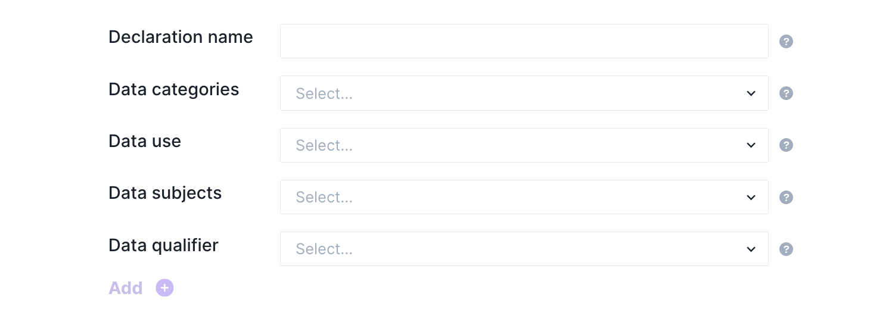

## Fides System Scanners 

In Fides, _systems_ describe any services that store or process data for your organization, including third-party APIs, web applications, databases, and data warehouses. Fides ships with automated infrastructure discovery capabilities, making detecting and adding new systems to your data map a straightforward process.

To get started, navigate to your hosted UI, which is available at `http://{server_url}/` (e.g. `http://localhost:8080/`) when your webserver is running, and select **Add Systems** from the navigation menu.

## System discovery

Fides can automatically discover new systems in your AWS infrastructure or Okta accounts. For services not covered by the automated scanners or analog processes, you may also manually add new systems to your map.

To begin, select your discovery method. The system discovery process will scan your infrastructure to create a list of all systems available, and then classify each system containing personally identifiable information.

### Authenticate with AWS

To authenticate with AWS, you must provide an Access Key ID, associated secret, and the AWS region your infrastructure is located in. Fides should be granted enough permissions to scan your AWS resources via an appropriate IAM policy.

### Authenticate with Okta
Fides requires a token to authenticate with Okta. You can find instructions on how to retrieve a suitable token from your Okta administration panel in the [Okta documentation](https://help.okta.com/oie/en-us/Content/Topics/Security/API.htm).

### Manual system generation
When creating a system manually, you will be asked to describe certain characteristics about your system. To learn more information about any field, hover over the question mark (?). 

Optionally, you may define a _privacy declaration_ for your system. A privacy declaration assigns the system a data use, and records the data subjects on which any data is collected. Defining a privacy declaration helps to describe your organization's privacy characteristics as a whole.

