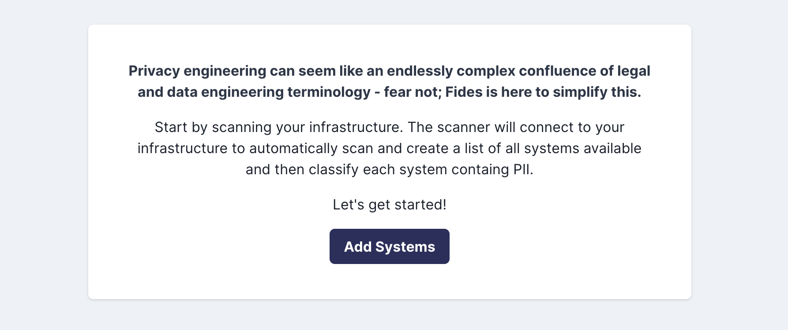
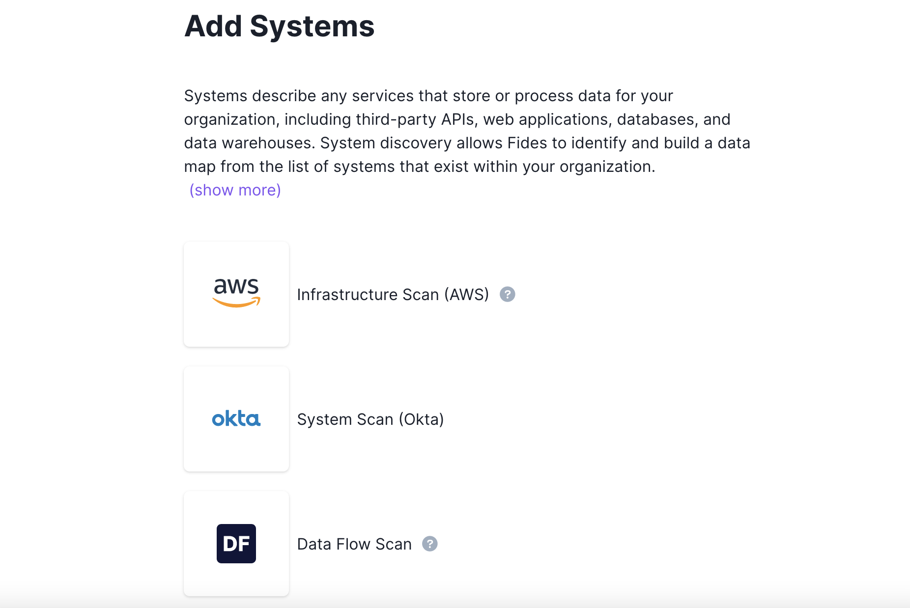
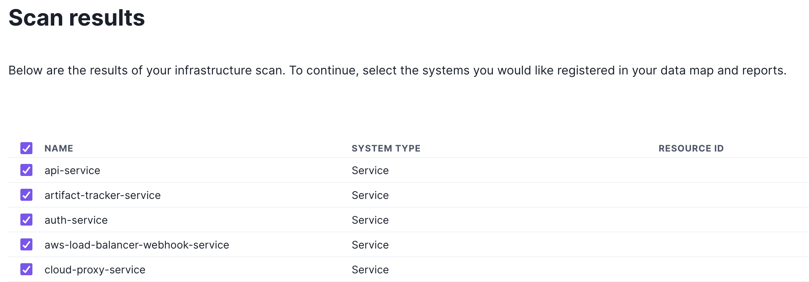
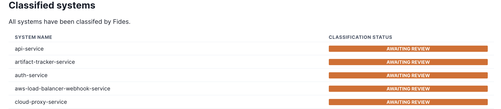
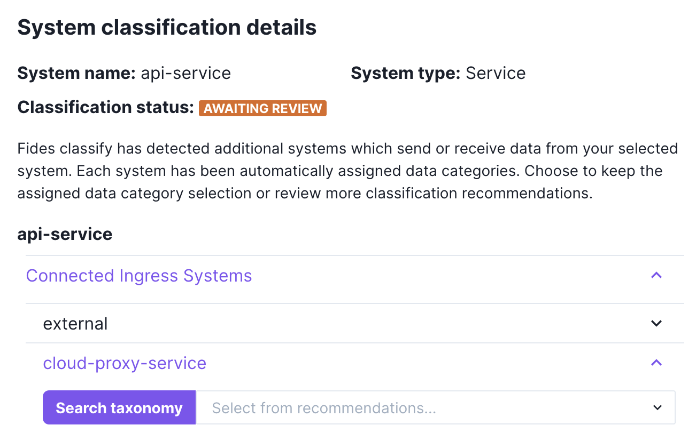

# Automated Data Flow Scanner

Fides provides a built-in data flow scanner that can be used to introspect systems and categories of data from traffic in your Kubernetes cluster. Systems found through the data flow scanner can be added to your data map, and quickly maintained with minimal manual intervention.



## Configuration 
Fides currently uses [Pixie](https://docs.px.dev/) to provide data flow scanning capabilities in your infrastructure. Prior to using the scanner, you will need to configure either a [self-hosted](https://docs.px.dev/installing-pixie/install-guides/self-hosted-pixie/) Pixie deployment, or use the free Pixie [Community Cloud](./https://docs.px.dev/installing-pixie/install-guides/community-cloud-for-pixie/). 

Follow the documentation for the deployment option of your choice. Once configured, Fides requires the following [environment variables](../fides/installation/configuration) to connect to your new Pixie instance:

Example `fides.toml`: 
```
[system_scanner]
cluster_id = "cluster_id"
enabled = true
pixie_api_key = "api_key"
use_encryption = true
```

Example environment variables: 
```
FIDESPLUS__SYSTEM_SCANNER__CLUSTER_ID="cluster_id"
FIDESPLUS__SYSTEM_SCANNER__PIXIE_API_KEY="api_key"
FIDESPLUS__SYSTEM_SCANNER__ENABLED=true
FIDESPLUS__SYSTEM_SCANNER__USE_ENCRYPTION=true
```
| Variable | Description |
| ---- | ---- |
| Cluster ID | The ID of your cluster with Pixie installed. To find the ID, see the [Pixie documentation](https://docs.px.dev/reference/admin/cluster-id/). |
| API Key | The API key Fides will use to access your Pixie cluster. To generate a new API key, see the [Pixie documentation](https://docs.px.dev/reference/admin/api-keys). |
| Enabled | Whether or not the data flow scanner is enabled. Default is `false`. Should be set to `true` when your Pixie configuration is complete. |

## Run the scanner
The Data Flow scanner can be run from the Add Systems option in the navigation menu. If you do not have any systems connected to Fides, attempting to use the [Data Map](./datamaps) will prompt you to add systems to begin.



Select the Data Flow scanner, and Fides will attempt to scan and classify your connected systems. Depending on how many services there are to scan, this process may take a few moments. 

Once complete, you will see a list of your scanned resources.



From this menu, use the checkboxes to select which systems to register. Registered systems will be added to your data map and [classified](./classifier).

### Classify your systems


Classified systems must be reviewed and approved manually. Double-clicking on any system row will allow you to view the details for that systems, including any classification results.



Fides attempts to connect systems which send or receive data to other systems, known as *data flows.* You may apply labels to each system to represent their purpose, or the information stored within. Completed systems will have their status changed to **Classified**.


Once all systems have been reviewed, select **Finish**, and you are ready to review your systems on your [data map](./datamaps)!
