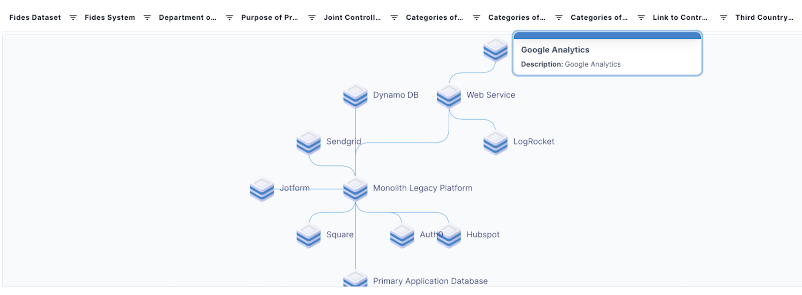
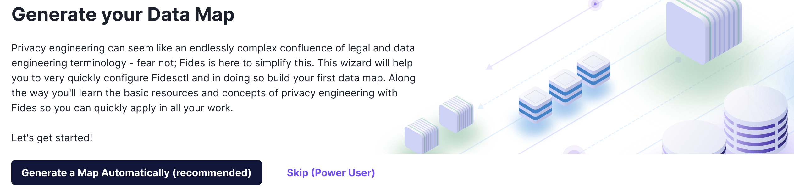
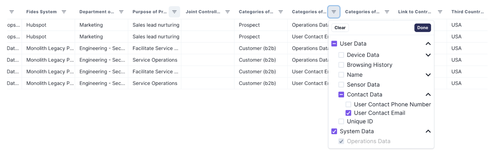
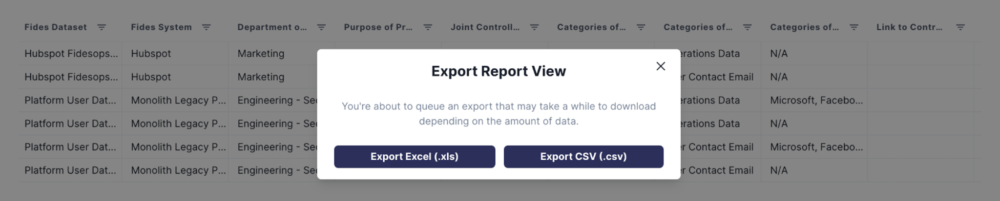
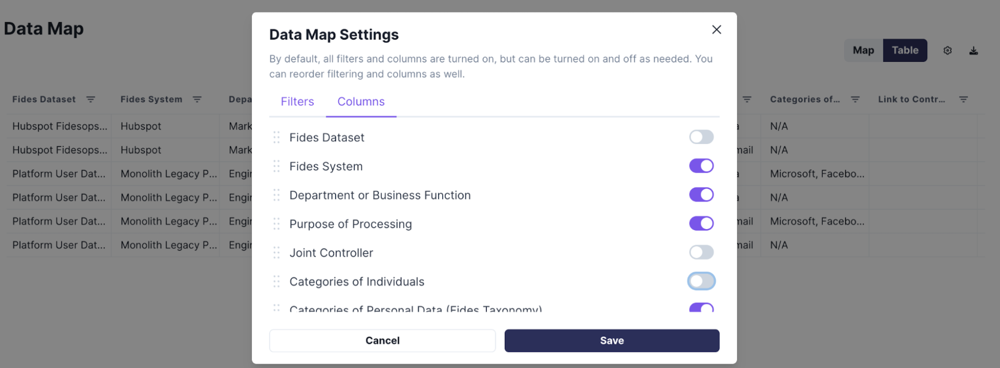

# Data Map Automation

A _data map_ represents a centralized view your organization, its systems, and the data any given system collects or stores. This map identifies the categories of sensitive or personal information collected by your systems, documents reasons for data processing and use, and tracks data formats, locations, and retention policies. 

Connecting your systems to Fides empowers your privacy stakeholders to understand the flow of data throughout your organization, and generate customized reports at the click of a button.

## Generate your datamap

In Fides, _systems_ describe any services that store or process data for your organization, including third-party APIs, web applications, databases, and data warehouses. Fides ships with automated infrastructure discovery capabilities, making detecting and adding new systems to your data map a straightforward process.

To begin, select **Add Systems** from the navigation menu. If you have no systems currently referenced by your data map, viewing your data map page will prompt you to to add your first.

### System discovery

Fides can automatically discover new systems in your AWS infrastructure or Okta accounts. For services not covered by the automated scanners or analog processes, you may also manually add new systems to your map.

To begin, select your discovery method. The system discovery process will scan your infrastructure to create a list of all systems available, and then classify each system containing personally identifiably information.

### Authenticate with AWS

To authenticate with AWS, you must provide an Access Key ID, associated secret, and the AWS region your infrastructure is located in. Fides should be granted enough permissions to scan your AWS resources via an appropriate IAM policy.

### Authenticate with Okta
Fides requires a token to authenticate with Okta. You can find instructions on how to retrieve a suitable token from your Okta administration panel in the [Okta documentation](https://help.okta.com/oie/en-us/Content/Topics/Security/API.htm).

### Manual system generation
When creating a system manually, you will be asked to describe certain characteristics about your system. To learn more information about any field, hover over the question mark (?). 

Optionally, you may define a _privacy declaration_ for your system. A privacy declaration assigns the system a data use, and records the data subjects on which any data is collected. Defining a privacy declaration helps to describe your organization's privacy charactaristics as a whole.

## Manage your data map

With your systems added, your data map is ready to use! 

The Fides data map provides several additional features to assist in viewing your organization and systems. 

Each view can be filtered by system resource metadata, to highlight and focus on systems with particular characteristics:

You may inspect your systems through both the visual map and a customizable tabular view, or export your results in multiple formats, including a GDPR-compliant Article 30 Record of Processing Activities: 

From the tabular view, the report can be customized to contain only the columns and data of interest:

