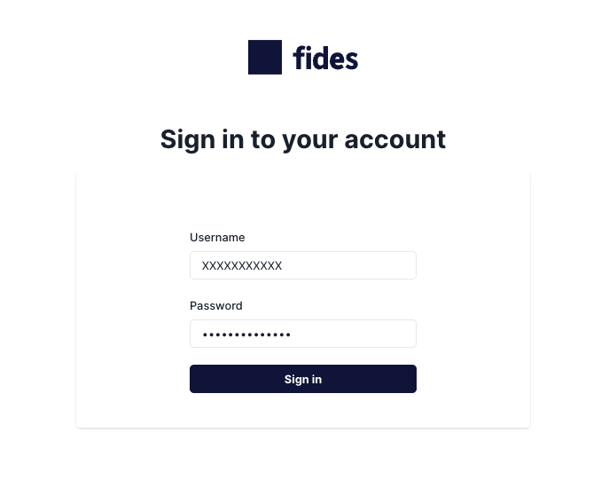
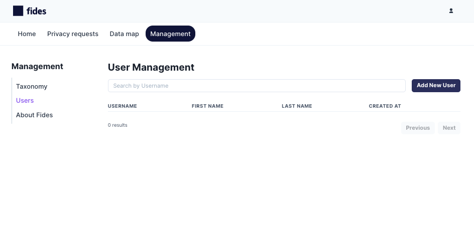
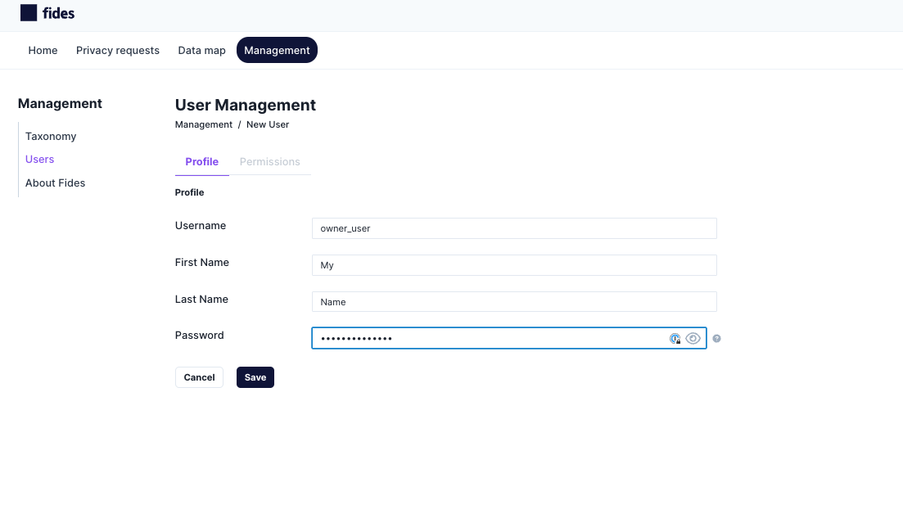
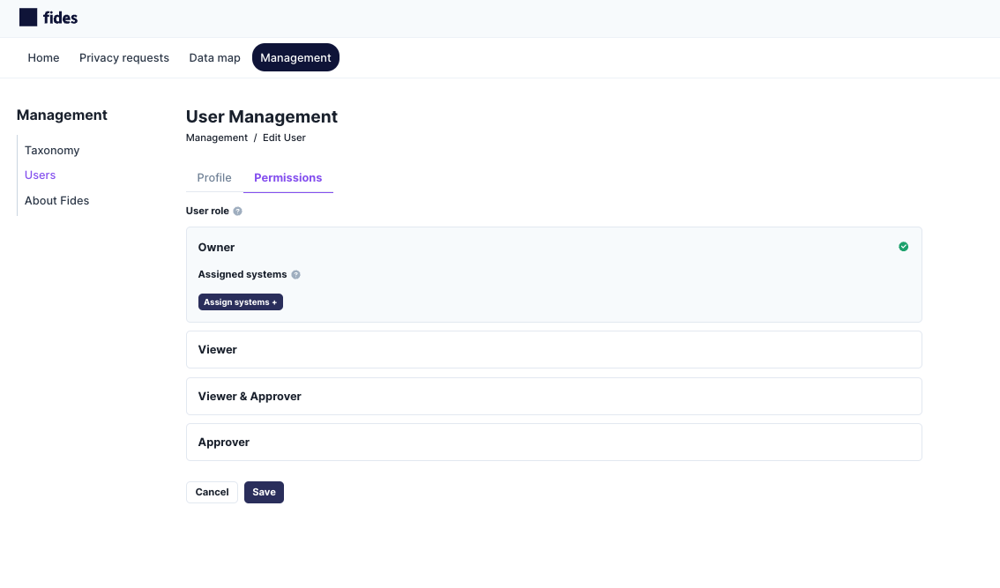
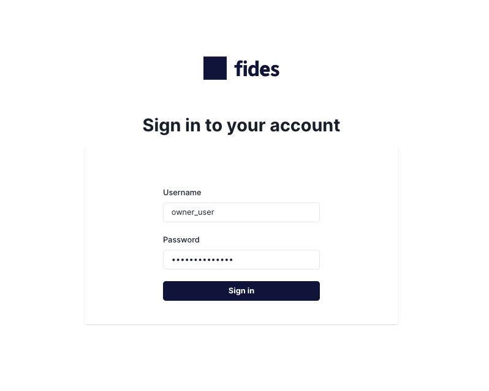
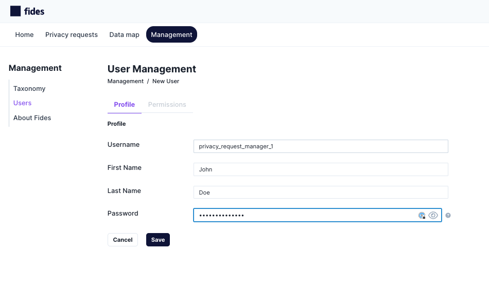
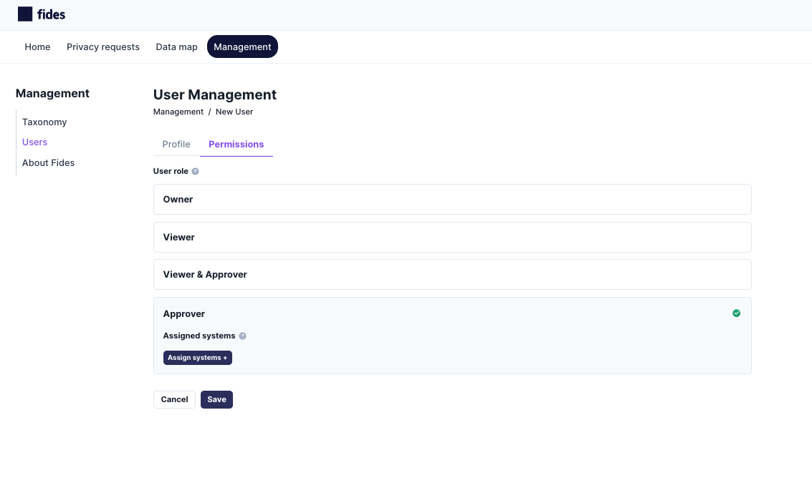
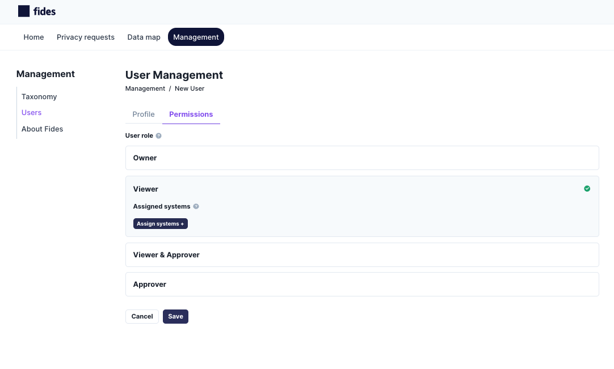
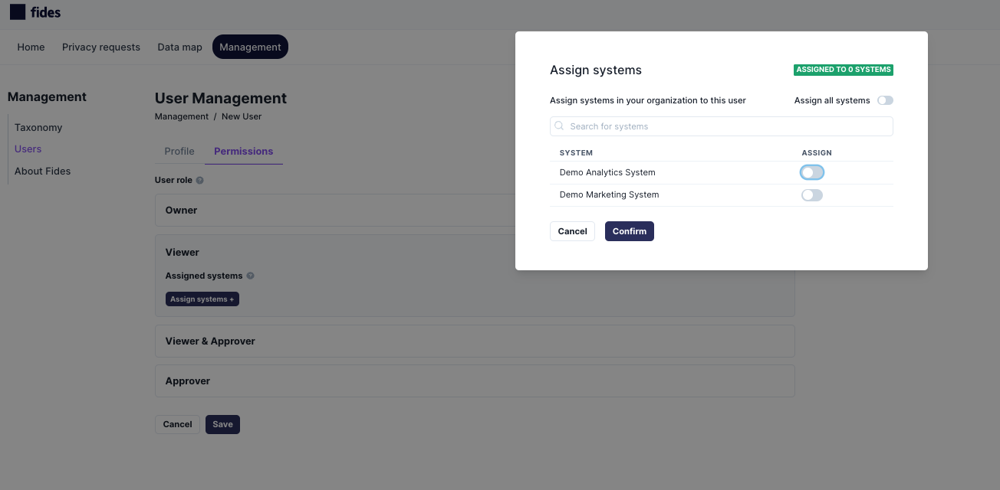
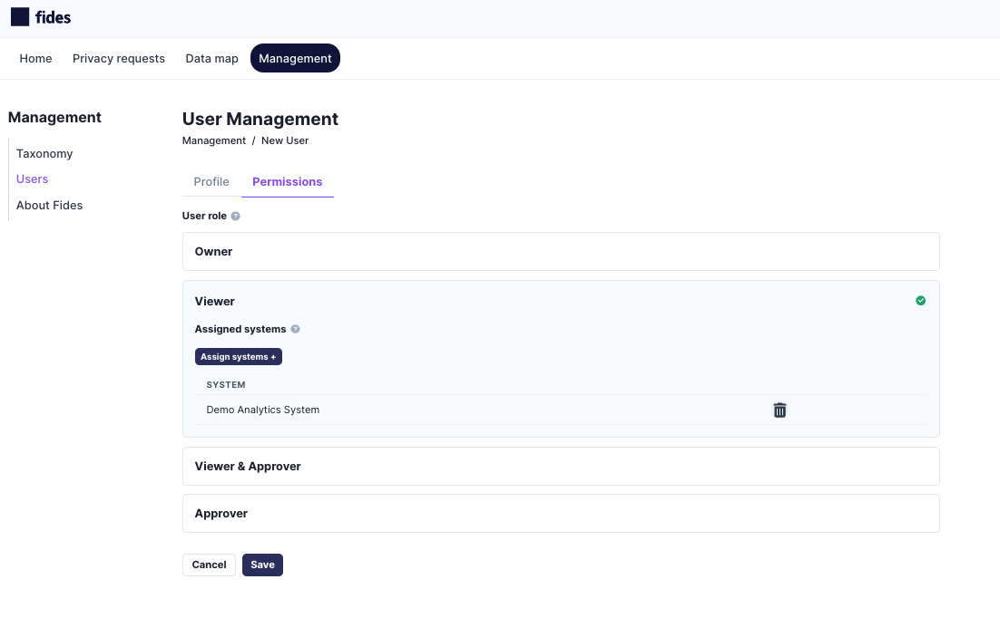

# Role-Based Access Controls

Fides uses Role-Based Access Controls which means that users can be assigned various roles within the organization that grant them a specific set of scopes (permissions). 

To get started, login as the root user to create your initial user. From there, you can create other users in your organization with various levels of responsibility.

## Available Roles

These are the current roles that can be granted to users within your organization:

- Owner: Full control over all settings and systems in the Data Map.
- Contributor: Full control over all settings and systems in the Data Map except for organization-wide system configurations like storage and messaging.
- Viewer + Approver: Read-only access to all settings and systems in the Data Map + can review and respond to privacy requests.
- Viewer: Read-only access to all settings and systems in the Data Map.
- Approver: Can approve and respond to privacy requests.

## Adding roles

### Logging in for the first time

The first time that you log into the system you will need to use the root user that Fides ships with to create new users. You should typically avoid using the root user for Fides management other than this initial account creation.

The root user is automatically granted all possible scopes.

### Setting up your first user 

Login as the root user using the `root_username` and `root_password` you previously configured during installation in the security section of `fides.toml` 
file. This may also be set using the `FIDES__SECURITY__ROOT_USERNAME` and `FIDES__SECURITY__ROOT_PASSWORD` environment variables.

Navigate to Management > Users.  Click on `Add New User`.

Add your username, your first and last name, and a strong password. Click `Save`.

On the Permissions tab, select the `Owner` role and click `Save`. As Owner, you will be able to manage all settings in Fides and create additional users:

### Configuring other users
To add other users, login as a newly created Owner account, and follow the same workflow above to assign various roles to users within your organization. In the example below, we are adding a user that can manage Privacy Requests.

Login as an Owner:

Create a user to manage Privacy Requests:

In the Permissions tab, add the `Approver` role to that user.  This user will be given limited read but will be able to manage Privacy Requests:

## Setting System Managers

Both Owners and Viewers can be assigned to systems as Data Stewards (system managers). For Viewers, this provides an elevated set of permissions to manage the assigned systems without changing their overall permissions. 

Note `Owners` can edit all systems without being assigned as the Data Steward due to having a role with broad admin access.

To assign systems to a user, first assign their role (ex. Viewer) and then use the `Assign Systems +` button to select the systems they should manage.
In this example, we click the `Viewer` row and then click `Assign Systems +`

In the Assign Systems modal, toggle on/off the specific systems that you want this user to manage and click `Confirm.`

In this example, the user now has a Viewer role which grants view-only access to all settings & systems in the Data Map . However, they have been assigned as the Data Steward for `Demo Analytics System` and can make updates to that specific system.

