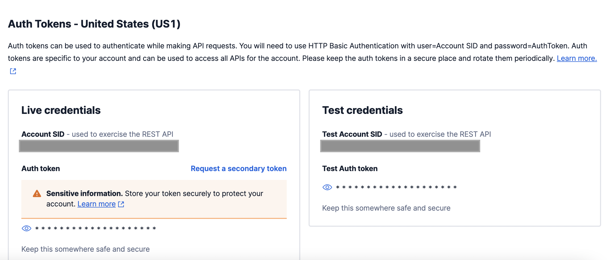

import Callout from 'nextra-theme-docs/callout'

# Configure Email/SMS Messaging
## What is email/SMS used for?

When your users submit a privacy request, you may want to send them messages to do things such as verify their identity or keep them informed of progress on their privacy request. Fides supports email and SMS service configurations for sending processing notifications to your users.

Supported modes of use:

- **`Subject Identity Verification`** -> Used to verify subject identity by sending an OTP (one-time-passord, or code) before proceeding with their privacy request. To learn more about how to use identity verification in subject requests, see the [Privacy Requests](../dsr_quickstart/dsr_support/privacy_requests#enable-subject-identity-verification) guide.
- **`Request Receipt Notification`** -> Used to send subject notifications upon privacy request receipt.
- **`Request Review Notification`** -> Used to send subject notifications upon privacy request review. Includes denial reason of the request, if applicable.
- **`Request Completion Notification`** -> Used to send subject notifications upon privacy request completion. Includes link to download data package, if applicable.


## Prerequisites

Fides currently supports <a href="https://www.mailgun.com" target="_blank">Mailgun</a> and <a href="https://www.twilio.com/en-us/sendgrid" target="_blank">Twilio (SendGrid)</a> for email messaging, and <a href="https://www.twilio.com/en-us/messaging" target="_blank">Twilio</a> for SMS messaging.

### Mailgun
When using Mailgun, ensure you register or use an existing Mailgun account in order to get up and running with email communications.

Mailgun can be setup to either use Mailgun templates, allowing for customization, or the generic Fides template.

#### Using Mailgun templates

1. Within Mailgun create a template named `fides`
1. The template can be setup as desired, but needs to contain a `{{{fides_email_body}}}`
variable. This is where the Fides email text will be placed.
1. In order to use the email template the Mailgun private API key needs to be provided in the
Fides Mailgun configuration.

When sending emails Fides will check to see if the `fides` template is available and use
it if so. If a `fides` template is not found the email will fall back to using the generic
Fides email template.

#### Using the default fides template

1. Generate a Mailgun Domain Sending Key

    Follow the [Mailgun documentation](https://documentation.mailgun.com/en/latest/api-intro.html#authentication-1) to create a new Domain Sending Key for Fides.

Alternatively the Mailgun private API key will also work for this option, but is not required.

### Twilio SMS

To configure messaging via SMS, you will need your Account SID and Auth Token (viewable in the `Api keys and tokens` section of your account settings), and either your Messaging Service ID or your Twilio sender phone number (both available in your Twilio console).



Use your messaging service ID if you've set up a specific messaging service in Twilio, otherwise use your Twilio sender phone number.


### Twilio Email (Sendgrid)

To configure messaging via email, you will need generate a Twilio API key.

Follow the [Twilio documentation](https://www.twilio.com/docs/iam/keys/api-key) to create a new API key for Fides.

## Configuration

Configuring Fides to integrate with a messaging provider can be done either by:
1. using the [hosted UI](#using-the-hosted-ui-basic-configuration)
2. or by making [API calls](#using-the-api-advanced-configuration), if desired for automation or advanced setup


### Using the hosted UI (basic configuration)
To get started, open up the Fides UI, navigate to the "Configure your privacy requests" page (`/privacy-request/configure`) and select the option to "Configure a messaging provider".

Select the appropriate messaging provider from the given options, enter your configuration details for the given provider, and click `Save`.

After doing this, Fides will be configured to send messages to users for _all_ types of notifications, using the messaing provider you've selected. Subject identity verification will also be enabled. If you'd like to send only specific types of messages to users, or if you would prefer to not require subject identity verification on privacy requests, please refer to the advanced API calls outlined in the ["Using the API"](#using-the-api-advanced-configuration) section below.

Below are the attributes you'll need to specify for each messaging provider you'd like to configure. Though you can configure details for multiple different messaging providers, only the selected messaging provider will be used by Fides to send messages at any given point.

#### Mailgun email attributes

| Attribute | Description |
|---|---|
| `Domain` | Your Mailgun domain |
| `API key` | Your Mailgun private API key |

#### Twilio email (SendGrid) attributes

| Attribute | Description |
|---|---|
| `Email` | The "From Email" you'd like Fides to send messages from |
| `API key` | Your Twilio API key |

#### Twilio SMS attributes

| Attribute | Description |
|---|---|
| `Account SID` | Your Twilio account SID |
| `Auth token` | Your Twilio account auth token |
| `Messaging Service SID` | A messaging service SID. Either this field or the `Phone Number` field must be specified |
| `Phone Number` | A messaging service SID. Either this field or the `Messaging Service SID` field must be specified |

### Using the API (advanced configuration)

If preferred, you can also make API calls to configure Fides to use your desired messaging provider, rather than using the hosted UI. This may be desirable if you'd like to configure Fides as part of an automated process, or if you require advanced configuration for a specific use-case.

#### Creating the messaging configuration

First, you can create a default messaging config for the messaging provider of your choice, and provide any non-sensitive configuration details:

##### Mailgun Config

```json filename="PUT /api/v1/messaging/default"
{
    "service_type": "mailgun",
    "details": {
        "domain": "{{mailgun_domain}}"
    }
}
```

#### Twilio SMS Config

```json filename="PUT /api/v1/messaging/default"
{
    "service_type": "twilio_text"
}
```

#### Twilio Email Config

```json filename="PUT /api/v1/messaging/default"
{
    "service_type": "twilio_email",
    "details": {
        "twilio_email_from": "{{twilio_from_email}}"
    }
}
```

#### Add the messaging configuration secrets

Next, you'll need to add any necessary sensitive configuration values (i.e., secrets) to the corresponding messaging configuration.

##### Mailgun Secrets

```json filename="PUT /api/v1/messaging/default/mailgun/secret"
{
    "mailgun_api_key": "{{mailgun_api_key}}",
}

```

#### Twilio SMS Secrets

```json filename="PUT /api/v1/messaging/default/twilio_text/secret"
{
    "twilio_account_sid": "{{twilio_account_sid}}",
    "twilio_auth_token": "{{twilio_auth_token}}",
    "twilio_messaging_service_sid": "{{twilio_messaging_service_id}}"
}

```

#### Twilio Email Secrets

```json filename="PUT /api/v1/messaging/default/twilio_email/secret"
{
    "twilio_api_key": "{{twilio_api_key}}",
}

```

| Field                          | Description                                                                                                                |
|--------------------------------|----------------------------------------------------------------------------------------------------------------------------|
| `mailgun_api_key`              | Your Mailgun Domain Sending Key.                                                                                           |
| `twilio_account_sid`           | Your Twilio Account SID.                                                                                                   |
| `twilio_auth_token`            | Your Twilio Auth Token.                                                                                                    |
| `twilio_messaging_service_sid` | Your Twilio Messaging Service SID. One of `twilio_messaging_service_sid` or `twilio_sender_phone_number` must be provided. |
| `twilio_sender_phone_number`   | Your Twilio Sender Phone Number. One of `twilio_messaging_service_sid` or `twilio_sender_phone_number` must be provided.   |
| `twilio_api_key`               | Your Twilio API Key.                                                                                                       |


#### Set global messaging settings

Lastly, you'll need to update global application settings related to messaging, to ensure messages are sent at the desired points and using the messaging configuration of your choice. Here you can also specify whether you'd like to require subject identity verification on privacy requests, which will also use the specified messaging configuration.

```json filename="PATCH /api/v1/config"
{
  "notifications": {
    "notification_service_type" : "mailgun",
    "send_request_completion_notification": true,
    "send_request_receipt_notification": true,
    "send_request_review_notification": true
  },
  "execution": {
    "subject_identity_verification_required": true,
  }
}
```

| Name                                   | Type   | Default | Description                                                                                                        |
| :------------------------------------- | :----- | :------ | :----------------------------------------------------------------------------------------------------------------- |
| `notifications.send_request_completion_notification` | bool   | `False` | When set to `True`, enables subject notifications upon privacy request completion.                                 |
| `notifications.send_request_receipt_notification`    | bool   | `False` | When set to `True`, enables subject notifications upon privacy request receipt.                                    |
| `notifications.send_request_review_notification`     | bool   | `False` | When set to `True`, enables subject notifications upon privacy request review.                                     |
| `notifications.notification_service_type`            | String | N/A     | Sets the notification service type used to send notifications. Accepts `mailgun`, `twilio_text`, or `twilio_email`. |
| `execution.subject_identity_verification_required` | bool | `False` | Whether privacy requests require user identity verification.                                                                                                                                                                                  |


#### Check the messaging configuration status

To check that your messaging configuration has been fully configured, you can invoke the following endpoint:

```json filename="GET /api/v1/messaging/default/status"
{
    "config_status": "configured",
    "detail": "Active default messaging service of type MAILGUN is fully configured"
}
```

This can help you confirm that you've done what's needed to configure a messaging configuration and that Fides will use during request execution.