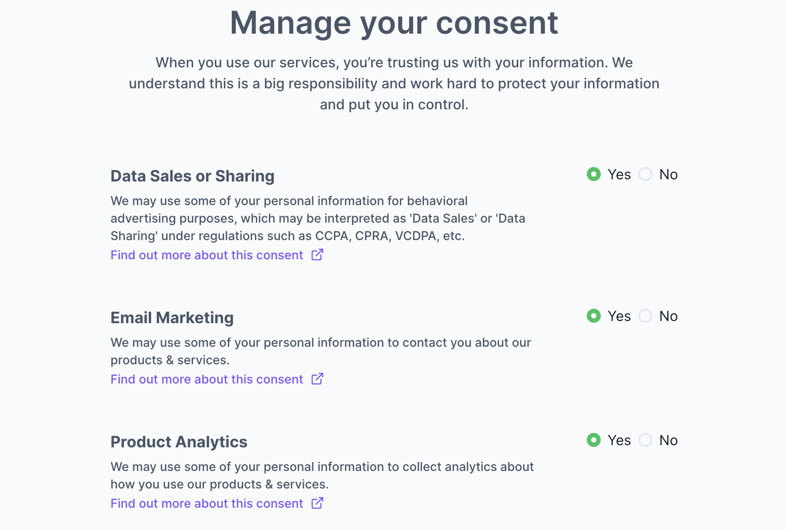

import Callout from 'nextra-theme-docs/callout'

# Manage Consent in the Privacy Center

The Fides Privacy Center provides configurable consent settings for regulatory compliance, allowing users to access and edit their data use preferences. 

To learn more about configuring your Privacy Center for DSR enforcement, see the [DSR automation guide](../dsr_quickstart/privacy_center).



## Configuration

The Fides Privacy Center's text and actions are managed by a `config.json` file, which should be located in your project’s `/clients/app/config` directory. More information on configuration options can be found in the [Privacy Center guide](../dsr_quickstart/privacy_center).

```json filename="config.json"
{
  "title": "Take control of your data",
  "description": "When you use our services, you’re trusting us with your information. We understand this is a big responsibility and work hard to protect your information and put you in control.",
  "server_url_development": "http://localhost:8080/api/v1",
  "server_url_production": "https://<$YOUR_SERVER_URL>/api/v1",
  "logo_path": "/logo.svg",
  "actions": [
    {
      "policy_key": "default_access_policy",
      "icon_path": "/download.svg",
      "title": "Access your data",
      "description": "We will email you a report of the data related to your account.",
      "identity_inputs": {
        "name": "optional",
        "email": "required",
        "phone": "optional"
      }
    },
    {
      "policy_key": "default_erasure_policy",
      "icon_path": "/delete.svg",
      "title": "Erase your data",
      "description": "We will delete all of your account data. This action cannot be undone.",
      "identity_inputs": {
        "name": "optional",
        "email": "required",
        "phone": "optional"
      }
    }
  ],
  "includeConsent": true,
  "consent": {
    "cookieName": "fides_consent",
    "consentOptions": [
      {
        "fidesDataUseKey": "advertising",
        "name": "Advertising / Data Sharing",
        "description": "We may use some of your personal information for advertising performance analysis and audience modeling for ongoing advertising which may be interpreted as 'Data Sharing' under some regulations.",
        "url": "https://example.com/privacy#advertising",
        "default": true,
        "highlight": false,
        "cookieKeys": ["data_sales"],
        "executable": true
      },
      {
        "fidesDataUseKey": "improve",
        "name": "Product Analytics",
        "description": "We may use some of your personal information to collect analytics about how you use our products & services, in order to improve our service.",
        "url": "https://example.com/privacy#data-sales",
        "default": true,
        "highlight": false,
        "cookieKeys": ["data_sales"],
        "executable": false
      },
      {
        "name": "Analytics",
        "fidesDataUseKey": "third_party_sharing",
        "description": "...",
        "url": "https://example.com/privacy#analytics",
        "cookieKeys": ["data_sharing"],
        "executable": false
      },
      {
        "name": "Personalize",
        "fidesDataUseKey": "personalize",
        "default": true,
        "url": "https://example.com/privacy#personalize",
        "description": "...",
        "cookieKeys": ["functional"],
        "executable": false
      },
      {
        "name": "Essential",
        "fidesDataUseKey": "provide.service",
        "default": true,
        "url": "https://example.com/privacy#essential",
        "highlight": true,
        "description": "...",
        "cookieKeys": ["essential"],
        "executable": false
      }
    ]
  }
}
```

| Key | Description |
|----|----|
| `title` and `description` | Basic information about the connector that can be overridden. |
| `server_url_development` | The Fides server URL to use for development deployments. |
| `server_url_production` | The Fides server URL to use for production deployments. |
| `logo_path` | The relative path to a brand or site logo to use instead of the default. |
| `actions` | A list of [action objects](#actions) that are associated with a single Fides policy. |
| `policy_key` | The key of the [policy](./dsr_support/execution_policies) to use for this action. |
| `icon_path` | The relative path of an icon to use instead of the default. |
| `identity_inputs` | The list of identities that are required by an action. |

### Consent
To provide compliance with local and internal regulations, you may define a series of [data uses](https://ethyca.github.io/fideslang/taxonomy/data_uses/) in your Privacy Center configuration. More information on including data uses for third-party services can be found in the [Google Tag Manager](./google_tag_manager) guide.

| Key | Description |
|----|----|
| `includeConsent` | Defines whether or not the consent options are enabled. |
| `cookieName` | The name of the stored cookie. |
| `title` and `description` | Basic information about the consent preference that can be overridden. |
| `url` | The URL where a user can view the consent notice. |
| `default` | If this consent preference is enabled (true) or disabled (false) by default. |
| `highlight` | Defines whether or not this consent preference is highlighted. |
| `cookieKeys` | The data use that is represented within your stored cookie. |
| `executable` |  Whether the user’s consent choice should be propagated to configured third party services |

## Actions
To learn more about configuring your Privacy Center for DSR enforcement, see the [DSR automation guide](../dsr_quickstart/privacy_center).

## Server-side Consent Enforcement

Most consent solutions generally focus on user consent in the browser by suppressing third-party cookies. Along with browser consent enforcement, Fides supports server-side enforcement of user consent. Fides communicates the user's consent to third-party vendors via API calls or email. This type of consent propagation can be considered more comprehensive and enduring. 

### How to configure Server-side consent 
When configuring consent options in the privacy center, you need to mark the executable tag as `true` for one of the consent options. When users change their preference(opt-in, opt-out) for the consent option marked as executable, all the SaaS connections with consent as an option are triggered to make consent requests. Connections internally will make API calls or email third-party vendors to notify user's preference changes.

<Callout> **Only one consent preference** is permitted to be executable at this time. After you set a consent option to be executable and if a user changes their preference for the consent option, then **all** the SaaS connections connected will be triggered. </Callout>

```
"consent": {
    "cookieName": "fides_consent",
    "consentOptions": [
      {
        "fidesDataUseKey": "advertising",
        "name": "Advertising / Data Sharing",
        "description": "We may use some of your personal information for advertising performance analysis and audience modeling for ongoing advertising which may be interpreted as 'Data Sharing' under some regulations.",
        "url": "https://example.com/privacy#advertising",
        "default": true,
        "highlight": false,
        "cookieKeys": ["data_sales"],
        "executable": true
      },
    ]
  }
```

Ethyca recently launched three new SaaS connectors to propagate user's consent to third-party vendors. 
After setting the executable flag to `true` for a consent option, please follow the configuration guide to set up the connectors.

1. [Wunderkind Consent Connector](../dsr_quickstart/saas_connectors/example_configs/wunderkind)
2. [Universal Analytics Consent Connector](../dsr_quickstart/saas_connectors/example_configs/universal_analytics)
3. [Sovrn Consent Connector](../dsr_quickstart/saas_connectors/example_configs/sovrn)

## Run the Privacy Center
The Privacy Center is provided in a separate Docker image. To begin, run the following command:

```
docker pull ethyca/fides-privacy-center
```

The Privacy Center can be deployed independently, or alongside any other hosted components. 

Once configured, the Privacy Center can be started with the following command:

```
docker run ethyca/fides-privacy-center
```
