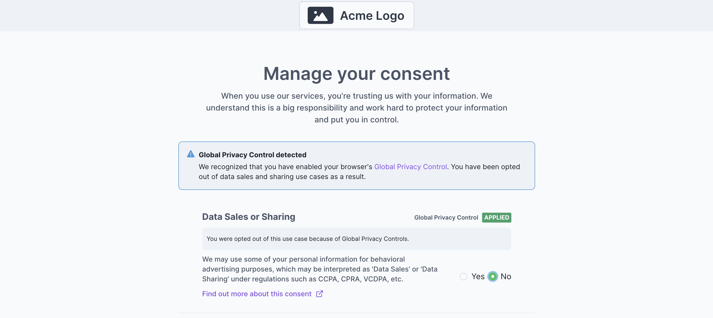
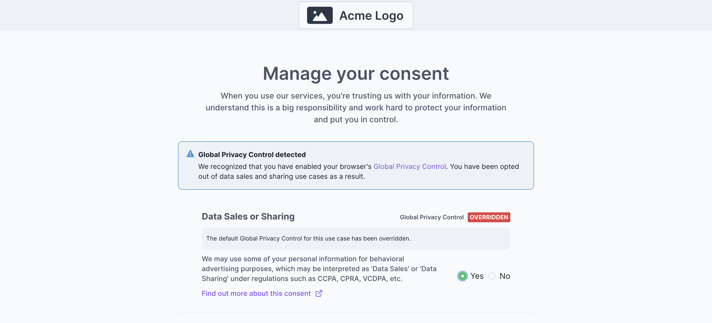

import Callout from 'nextra-theme-docs/callout'

<Callout emoji="ⓘ">
Pre-release documentation. The documentation on this page is for a pre-release feature. The details described here are subject to change prior to release.
</Callout>


# Global Privacy Control Support in Fides

Fides includes features to set a user’s consent preferences based on the presence of a global privacy control signal.

## What is Global Privacy Control?

From the website: [Global Privacy Control - Take Control Of Your Privacy](https://globalprivacycontrol.org/)

> Global Privacy Control (GPC) is a proposed specification designed to allow Internet users to notify businesses of their privacy preferences, such as whether or not they want their personal information to be sold or shared. It consists of a setting or extension in the user’s browser or mobile device and acts as a mechanism that websites can use to indicate they support the specification.

The specification manifests in a signal which can be read and interpreted by consent platforms and websites to automatically opt out users from data sales and sharing use cases.

## How will Fides Support Global Privacy Control?

### Version 1 - Estimated release March 2nd

#### Configuration

Global Privacy Control support in Fides can be enabled by adding a configuration to the privacy center consent options within the privacy center config.json file.

In your config.json file, you can select which consent options should respect a GPC signal by adding a flag under the `default` property. See the following example:

```json filename="config.json"
"consentOptions": [
      {
        "fidesDataUseKey": "advertising",
        "name": "Data Sales and Sharing",
        "description": "We may use some of your personal information for behavioral advertising purposes, which may be interpreted as 'Data Sales' or 'Data Sharing' under regulations such as CCPA, CPRA, VCDPA, etc.",
        "url": "https://example.com/privacy#data-sales",
        "default": {
          "value": true,
          "globalPrivacyControl": true
        },
        "highlight": false,
        "cookieKeys": ["data_sales"],
        "executable": false
      },
```

In this example, the consent option title “Data Sales and Sharing” has GPC applied by virtue of the new flag on line 9. For guidance on which data use cases should respect GPC, see the [Define which geography to apply GPC](https://docs.ethyca.com/regulations/gpc/geo_gpc) section of the documentation. Please note, that in version 1 of GPC support, Fides does not detect the location of visitors to your site.

<Callout emoji="ⓘ">
As a result, we recommend that you enable GPC for any use cases which require it for visitors from California as this will cover visitors from the rest of the United States until location based enforcement of GPC is supported by Fides.
</Callout>

Once you have made this update to the privacy center configuration, rebuild and redeploy your privacy center for the changes to take effect. The build process will also rebuild the fides-consent.js script which should be included on your site, so that GPC choices are applied to consent options before a user visits the privacy center.

#### Consumer Experience

After you have updated and deployed your privacy center changes, users who visit your site with a GPC flag on their browser will have their choices respected.

**First Time visitor**

When a user visits your site for the first time and has GPC enabled, their consent preferences will be automatically set on the Fides consent object on their browser window according to their GPC flag and the configuration provided in the privacy center config.json

```json
{
  "consent": {
    "advertising":false
   }
}
```

All web-based services which have been integrated with Fides consent will honor this preference in the same way that they honor the consent preferences of users without GPC enabled, either via direct integration with the Fides consent object or third party tag managers like Google Tag Manager.



**Visitors with Conflicting Preferences**

Visitors to your site who choose to opt-in to a data use case that respects GPC will be informed of their decision while in the privacy center so that they have the opportunity to confirm that they consent to override their GPC signal.

A user who overrides their GPC preference will see that choice reflected on the data use case:



### Consent Records with GPC

For each consent preference saved via the privacy center, Fides will record up to two pieces of information related to GPC.

1. Was GPC enabled? This will be present for all users and will indicate if the user had GPC enabled when they saved their preferences.
2. Conflicting GPC signal - This will be present for all consent records when the user opted in to a use case which would be opted out of because they have GPC enabled. This will allow you an additional level of explicit detail when a user chooses to apply a consent preference that conflicts with their own GPC signal.

To get the consent preferences of a user, make a request to the endpoint:

```
POST: /api/v1/consent-request/preferences
```

The request body contains the identity of the user:
```json
{
    "email": "user@example.com"
}
```

Future versions of consent recording will provide additional details and the ability to list all consent preferences.

## Communicate that you support GPC

After these changes are released, we recommend including support representation to indicate that your site abides by GPC. To do this, you should return a JSON object from the URL `<http://<yourdomain>/.well-known/gpc.json` where `<yourdomain>` is replaced with the domain of your website. The JSON object should be formatted as follows:

```json
{
  "gpc": true,
  "lastUpdate": "2023-01-14"
}
```

The `lastUpdate` value should be the date from which you add this new response.

The content-type must be `application/json`

This support representation is [recommended by the GPC specification](https://privacycg.github.io/gpc-spec/#gpc-support-resource) to indicate to site visitors and third parties that you abide by GPC. 