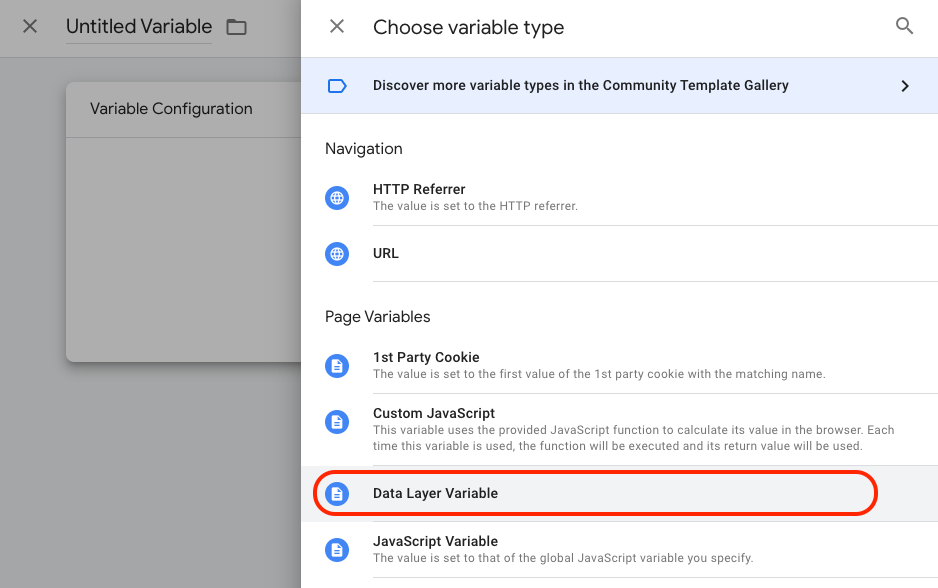
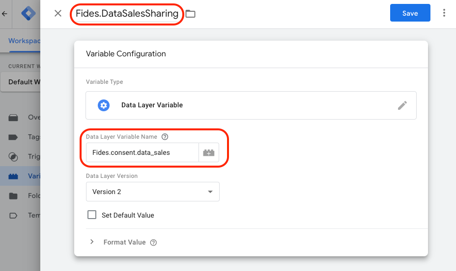
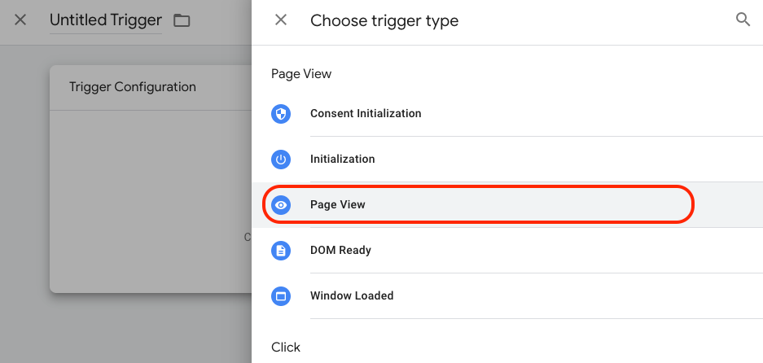
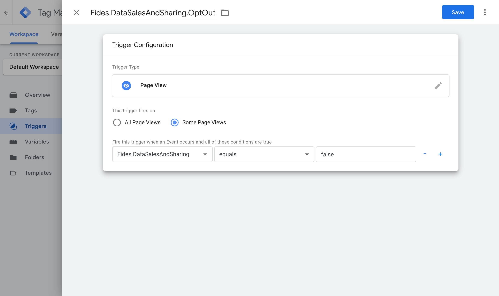
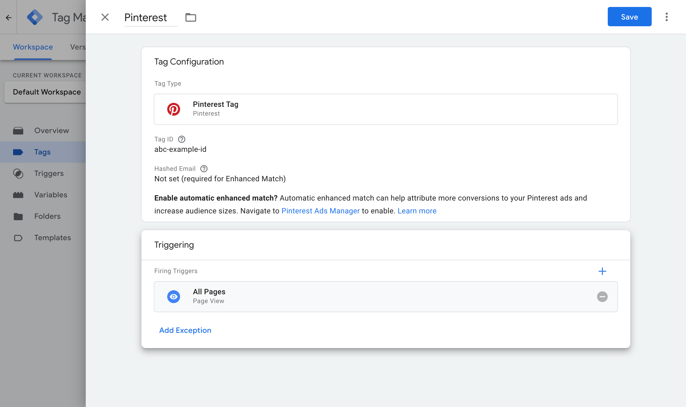
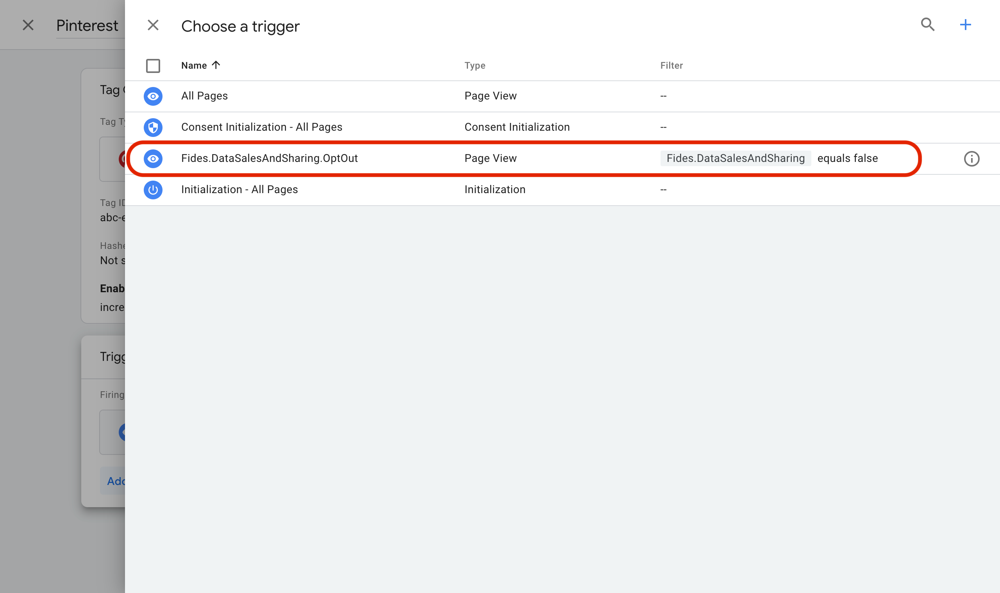
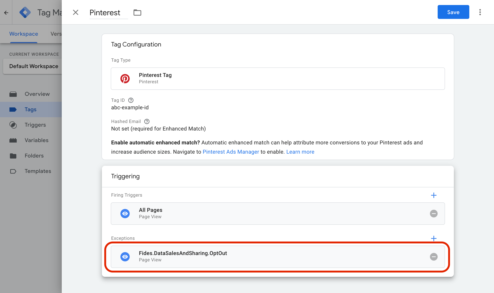
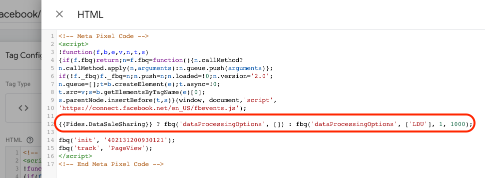
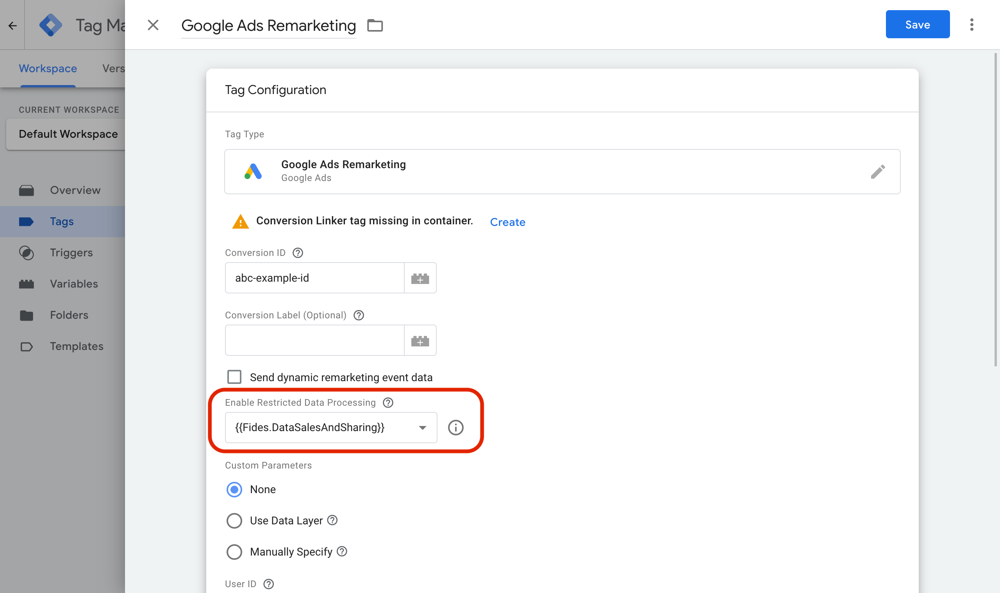

import Callout from 'nextra-theme-docs/callout'

# Configuring Consent in Google Tag Manager 

Current and upcoming state privacy regulations (e.g. CPRA, VCDPA, CPA) require organizations to offer consumers the right to opt in or out of a variety of data uses, such as data processing for sales, data sharing, and sensitive information processing.

Once you have configured and deployed your [Privacy Center](./consent_management), Fides allows your users to save their privacy settings according to your customized consent configuration, and uses these stored consent choices to enable or disable corresponding data uses. 

## Update your Privacy Center configuration
Consent options are defined within the Privacy Center [configuration](./consent_management#consent). The consent section of your `config.json` contains a list of `consentOptions`, which represent the data use cases (e.g. Data Sales, Data Sharing) that you would like to let your users opt in or out of.

```json
"consent": {
    "title": "Manage your consent",
    "description": "Manage your consent preferences, including the option to select 'Do Not Sell My Personal Information'.",
    "cookieName": "fides_consent",
    "icon_path": "/consent.svg",
    "consentOptions": [ {
        "fidesDataUseKey": "advertising",
        "name": "Advertising / Data Sharing",
        "description": "We may use some of your personal information for advertising performance analysis and audience modeling for ongoing advertising which may be interpreted as 'Data Sharing' under some regulations.",
        "url": "https://example.com/privacy#advertising",
        "default": true,
        "highlight": false,
        "cookieKeys": ["data_sales"]
        }
    ]
}
...
```

| Attribute | Description |
| --- | --- |
| `includeConsent` | Whether the consent options are enabled.
| `cookieName` | The name of the stored cookie.
| `title` and `description` | Text fields to override the default text of the associated consent option.
| `url` | The URL where a user can find additional information about this data use.
| `default` | If this consent preference is enabled (true) or disabled (false) by default.
| `highlight` | Whether or not this consent preference is highlighted.
| `cookieKeys` | The data use represented within your stored cookie.  This key will correspond to the variable names in later steps, and will be used by scripts and/or third-party services (like Google Tag Manager) to access your users’ consent settings. |


### Implement the consent script

The Privacy Center’s `fides-consent` package builds a script that can be used in a given web page to access the consent choices a user has made using the Privacy Center.

To use the script, the following should be included within the `<head>` tag of your page:

```html
<head>
  <!-- Include before any scripts which need consent. -->
  <script src="example.com/privacy-center/fides-consent.js"></script>
</head>
```

| Attribute | Description |
| --- | --- |
| `example.com/privacy-center` | Replace this with the URL to your deployed Privacy Center.


### Push consent options to Google Tag Manager
When using Google Tag Manager, calling `Fides.gtm()` will push the user's consent choices into GTM's Data Layer under Fides.consent. 

```html
<head>
  <script src="example.com/privacy-center/fides-consent.js"></script>
  <script>Fides.gtm()</script>

  <!-- Include Google Tag Manager's script below. -->
<head>
```

See the [end of this guide](#configure-consent-in-google-tag-manager-gtm) for more information on using Google Tag Manager.

### Usage options
In any code which requires user consent, you can now check a user’s consent map under the Fides global variable:
```js
if (Fides.consent.data_sales) {
  // User has opted in.
} else {
  // User has opted out.
}
```

In the above example, `data_sales` matches the cookieKeys set during your Privacy Center configuration:

```json
...
    "consentOptions": [
      {
        "fidesDataUseKey": "advertising",
        "name": "Advertising / Data Sharing",
        "description": "We may use some of your personal information for advertising performance analysis and audience modeling for ongoing advertising which may be interpreted as 'Data Sharing' under some regulations.",
        "url": "https://example.com/privacy#advertising",
        "default": true,
        "highlight": false,
        "cookieKeys": ["data_sales"]
      }
...
```

## Configure consent in Google Tag Manager (GTM)
The following step-by-step implementation will use the cookieKeys created during your Privacy Center configuration. To begin, open your GTM console and select **Variables** from the navigation menu. 

### Set up a GTM variable
1. From the Variables menu, click **New** within the **User-Defined Variables** section.

2. Select **Data Layer Variable** (beneath Page Variables) as the type:



3. Set the **Data Layer Variable Name** to the corresponding `consentKey` configured in your Privacy Center (Fides.consent.data_sales in this guide’s examples).

4. Give the variable a suitable, identifiable name, such as Fides.DataSalesSharing, as in the example below:



### Configure a Trigger Tag for consent
Many third-party tools rely on you to correctly configure their tags to fire depending on user consent. A single consent trigger tag ensures that a third-party tag only fires when a user’s consent is appropriately set.

1. Create a new Trigger by selecting **New** from the Tags menu.

2. Select the appropriate tag type (e.g. Page View):




<Callout> Ensure you use the appropriate trigger type for your tag. If your primary firing trigger is Page View based, use the **Page View** exception trigger. If your primary firing trigger is Custom Event based, use the **Custom Event** exception trigger.</Callout>

3. Give the trigger a suitable, identifiable name, such as Fides.DataSales.Consent.

4. Set “This trigger fires on” to Some Page Views.

5. In the “Fire this trigger when…” option, set the following:
    * The **event field** to Fides.DataSaleSharing (this matches the user-defined variable created earlier)
    * The **evaluation** to `equals`
    * The **value** to `false`



This new trigger event can now be added to your tags, and will ensure the tag is suppressed where the user has opted out (e.g. when a user’s consent preference has set **DataSalesSharing** to false.)

<Callout>You can repeat this step to include the condition on other types of triggers as you require them.  For example, this condition could be on Custom Events, Page Views, Window Loads or Initialization.</Callout>

### Use a custom consent trigger on a tag
To suppress tags from firing where user consent has not been given, you can add your new trigger using the following steps:

1. From the Tags menu, select the tag you would like to apply consent checks to.

2. Under **Triggering** you can add, remove or combine triggers. In this case, you are adding an _exception_ that will suppress firing where you do not have consent. Select **Add Exception** to add your newly created trigger.



3. Select the consent trigger created earlier (e.g. Fides.DataSales.Consent), which will add it as an exception to your tag:



You should now see your trigger listed in your tag as an Exception. If configured according to this guide, this tag will no longer fire if a user has opted out of Data Sales. 



You can now repeat this on any tag in your GTM container.

### Configure Limited Data Use for Meta (Facebook)

Meta's implementation of data sales is unique to their platform, and requires specific configuration in Google Tag Manager.

To implement the Limited Data Use flag, the following modifications to your pixel are required:



1. Add the line below _before_ `fbq('init', '00000000000');`

```
{{Fides.DataSaleSharing}} ? fbq('dataProcessingOptions', []) : fbq('dataProcessingOptions', ['LDU'], 1, 1000);
```

This line checks the value of Fides.DataSaleSharing, and will opt a user out of or into data processing based on its value (`true` or `false`).

<Callout> If your Meta pixel is using the `<noscript></noscript>` for non-javascript browsers, _remove this_ from your pixel. Consent management solutions, like Fides, rely on javascript; this pixel would risk firing, causing non-compliance.</Callout>

3. Save your changes. Your Limited Data Use is now configured!

### Configuring Restricted Data Processing for Google Ads

In order to configure Google's Restricted Data Processing flag, minor updates are required for the Google Ads pixel. _Make sure you have completed your [custom consent triggers](#use-a-custom-consent-trigger-on-a-tag) before proceeding._

1. Edit your Google Ads Pixel:

2. In the dropdown list labeled "Enable Restricted Data Processing", select the appropriate variable that you created [at the start](#set-up-a-gtm-variable) (e.g. Fides.DataSaleSharing).




3. Save your changes, and repeat for any other Google Adsense (or similar Google integrations) that allow for restricted data processing options.
