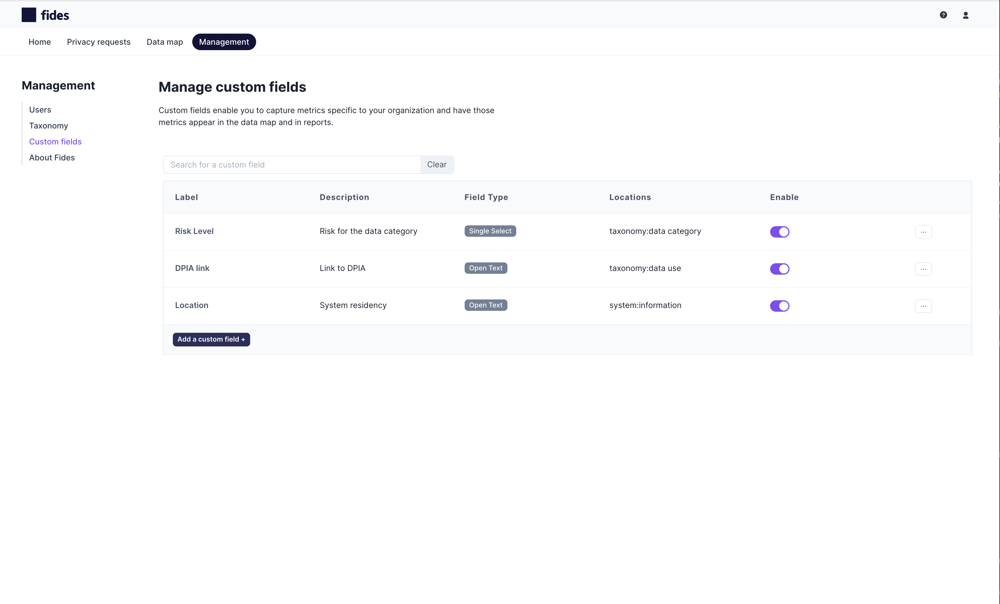
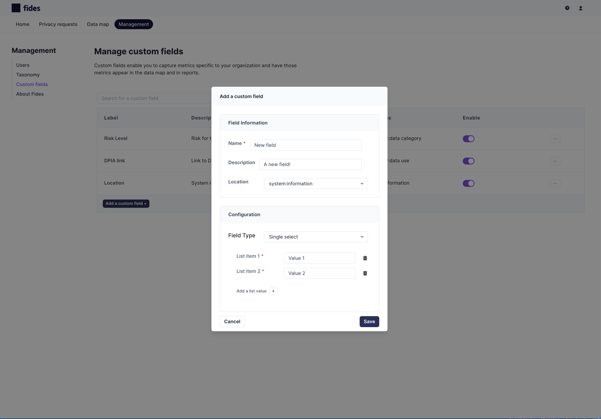
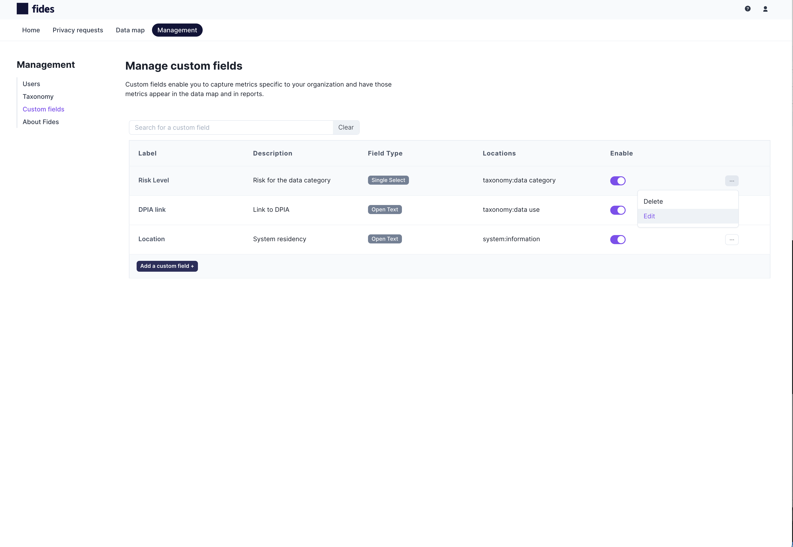

import Callout from 'nextra-theme-docs/callout'

<Callout emoji="ⓘ">
This feature is only available for Fides business customers. If you are interested in using custom fields in your Fides deployment, reach out to the Ethyca team to discuss.</Callout>

# Manage custom fields
Custom fields enable you to define metrics that are specific to your business for system information or taxonomy elements. 
Fides includes all the privacy-related fields that are typically required to prove compliance or export a ROPA but some organizations may want to capture additional information for internal tracking or reporting purposes.

Custom fields can be either open-text fields or drop-down lists of values that can be placed on the following resources: 

| Location | Resource | Description |
| ---------------- | ---------------- | ---------------- |
| System | Information | A custom field placed in `system:information` will appear for every **system** in the Data Map under the `System information` tab of the system portal. Individual values may be set for each system. These fields are reportable and will appear as columns in the Data Map table. |
| System | Data use declaration | A custom field placed in `system:data use` will appear for every **system**  in the Data Map under the `Data uses` tab of the system portal. Individual values may be set for each data use declaration. These fields are reportable and will appear as columns in the Data Map table.|
| Taxonomy | Data use | A custom field placed in `taxonomy:data use` will appear for every **data use** element in the Taxonomy and individual values may be set for each data use. These are not reportable fields and will not appear as columns in the data map. |
| Taxonomy | Data category | A custom field placed in `taxonomy:data category` will appear for every **data category** element in the Taxonomy and individual values may be set for each data category. These are not reportable fields and will not appear as columns in the data map.|
| Taxonomy | Data subject | A custom field placed in `taxonomy:data subject` will appear for every **data subject** elementin the Taxonomy and individual values may be set for each data subject. These are not reportable fields and will not appear as columns in the data map.|

Custom fields are managed using the **Custom fields** section of the Management panel in Fides UI:

From this page, you may:
- [Create new custom fields](#create-new-custom-fields) 
- [Edit custom fields](#edit-custom-fields)
- [Delete custom fields](#delete-custom-fields)
- [Enable or disable custom fields](#enable-or-disable-custom-fields)
- [Duplicate custom fields](#duplicate-custom-fields)

## Create new custom fields ##

To create a new custom field:
1. Go to the custom fields section of the Management panel: Management > Custom fields.
2. Click **Add a custom field +**.
3. Fill in a **Name** & **Description** for the field. *Note: name must be unique!*
4. Select a **Location** and the corresponding resource for the field (ex. `system:data use`).
5. Select a **Field Type**: open text, single select, multi-select and specify the allowed values, if applicable.
Click **Save**.

##  Edit custom fields ##

To edit custom fields you may either:
1. Click on the row in the table corresponding to that field.
2. Click on the `kebab` menu and select **Edit**

##  Delete custom fields ##

To delete custom fields you click on the `kebab` menu and select **Delete**

## Enable or disable custom fields ##

To enable or disable custom fields, click on the toggle in the row corresponding to that field. Disabling a custom field will hide this field in all places.

## Duplicate custom fields ##
Coming soon!

