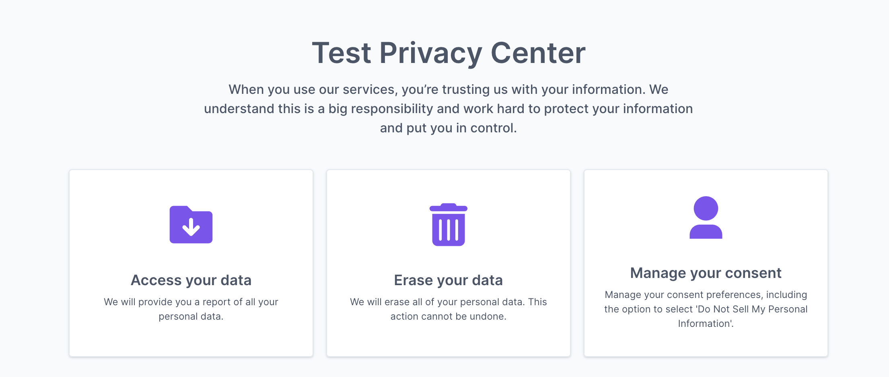

# Privacy Center

The Fides Privacy Center is a configurable webpage where users can request to download or delete their data. The Privacy Center is managed in an independent [Docker image](#run-the-privacy-center), allowing you to begin receiving privacy requests in minutes.



## Configuration

The Fides Privacy Center's text and actions are managed by a `config.json` file in the Fides `/app/config` directory.

```json filename="config.json"
{
  "title": "Take control of your data",
  "description": "When you use our services, you’re trusting us with your information. We understand this is a big responsibility and work hard to protect your information and put you in control.",
  "server_url_development": "http://localhost:8080/api/v1",
  "server_url_production": "https://<$YOUR_SERVER_URL>/api/v1",
  "logo_path": "/logo.svg",
  "actions": [
    {
      "policy_key": "default_access_policy",
      "icon_path": "/download.svg",
      "title": "Access your data",
      "description": "We will email you a report of the data related to your account.",
      "identity_inputs": {
        "name": "optional",
        "email": "optional",
        "phone": "optional"
      }
    },
    {
      "policy_key": "default_erasure_policy",
      "icon_path": "/delete.svg",
      "title": "Erase your data",
      "description": "We will delete all of your account data. This action cannot be undone.",
      "identity_inputs": {
        "name": "optional",
        "email": "optional",
        "phone": "optional"
      }
    }
  ],
  "includeConsent": true,
  "consent": {
    "cookieName": "fides_consent",
    "consentOptions": [
      {
        "fidesDataUseKey": "advertising",
        "name": "Advertising / Data Sharing",
        "description": "We may use some of your personal information for advertising performance analysis and audience modeling for ongoing advertising which may be interpreted as 'Data Sharing' under some regulations.",
        "url": "https://example.com/privacy#advertising",
        "default": true,
        "highlight": false,
        "cookieKeys": ["data_sales"]
      },
      {
        "fidesDataUseKey": "improve",
        "name": "Product Analytics",
        "description": "We may use some of your personal information to collect analytics about how you use our products & services, in order to improve our service.",
        "url": "https://example.com/privacy#data-sales",
        "default": true,
        "highlight": false,
        "cookieKeys": ["data_sales"]
      },
      {
        "name": "Analytics",
        "fidesDataUseKey": "third_party_sharing",
        "description": "...",
        "url": "https://example.com/privacy#analytics",
        "cookieKeys": ["data_sharing"]
      },
      {
        "name": "Personalize",
        "fidesDataUseKey": "personalize",
        "default": true,
        "url": "https://example.com/privacy#personalize",
        "description": "...",
        "cookieKeys": ["functional"]
      },
      {
        "name": "Essential",
        "fidesDataUseKey": "provide.service",
        "default": true,
        "url": "https://example.com/privacy#essential",
        "highlight": true,
        "description": "...",
        "cookieKeys": ["essential"]
      }
    ]
  }
}
```

| Key | Description |
|----|----|
| `title` and `description` | Text fields to override the default text of either the main portal, or the associated action. |
| `server_url_development` | The Fides server URL to use for development deployments. |
| `server_url_production` | The Fides server URL to use for production deployments. |
| `logo_path` | The relative path to a brand or site logo to replace the default. |
| `actions` | A list of [action objects](#actions), each of which represent a new tile available in the portal, and are associated to a single Fides policy. |
| `policy_key` | The key of the [policy](./dsr_support/execution_policies) to use for this action. |
| `icon_path` | The relative path of an icon to replace the defaults. |
| `identity_inputs` | The list of personally identifiable information required by an action.<br /><br />Please note that email and phone number are mutually exclusive. A user may submit an email, or a phone number, but not both at the same time. One of the two is always required. Setting both to optional will let the user choose one or the other. |

### Actions

Actions represent available privacy rights executable from the Privacy Center. The provided `config.json` includes Download and Delete default, representing common requests to access or remove data under most privacy regulations. Each action is associated with a Fides [policy key](./dsr_support/execution_policies), which defines the policy executed when the DSR is approved.

Additional actions can be added to this list, and removed at any time.

### Identity Inputs

Identity inputs represent the staring point for the Privacy Request execution by the fides engine. Fides currently supports starting with an email or a phone number. From here, the user's information will be returned. 

As part of the data traversal, all linked identities will be returned if configured. 

For example, in the Privacy Request's fulfillment, if a phone number is linked to an email or visa-vera, all relevant data will be returned in the privacy request. To learn more about the fulfillment of Privacy Requests, please see the [query execution guide](./dsr_support/query_execution). 

### Consent
The Fides privacy center also includes options for managing consent. To learn more about enabling consent management, see the [consent enforcement guides](../consent/consent_management).

### Styling

Any overrides for CSS styling can be included in a `config.css` file in the `/app/config` directory.


## Run the Privacy Center
The Privacy Center is provided in a separate Docker image. To begin, run the following command:

```
docker pull ethyca/fides-privacy-center
```

The Privacy Center can be deployed independently, or alongside any other hosted components. 

Once configured, the Privacy Center can be started with the following command:

```
docker run ethyca/fides-privacy-center
```
