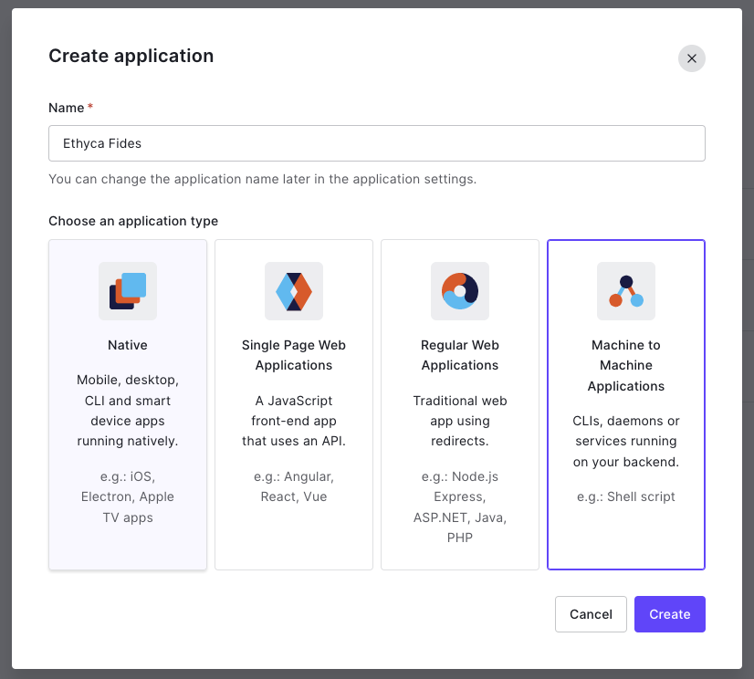
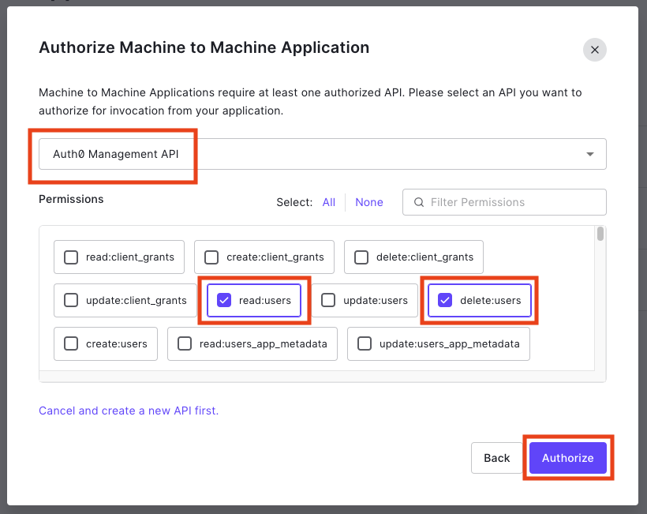
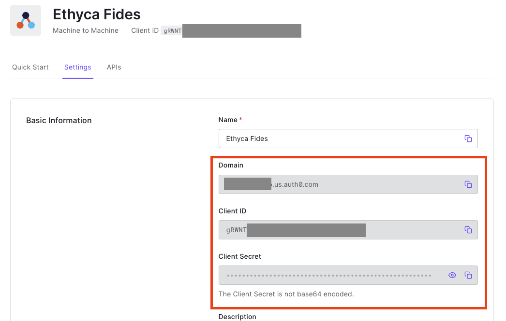
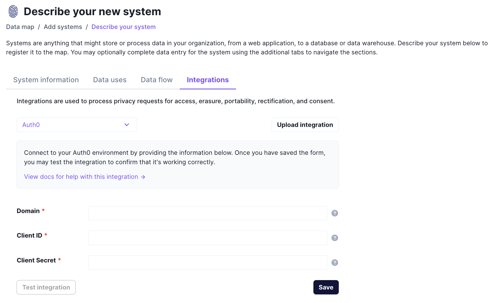

# Auth0

## Implementation Summary

Fides uses the following Auth0 endpoints to retrieve and delete Personally Identifiable Information (PII) when processing a Privacy Request. Right to Access and Right to Delete (Right to Forget) support for each endpoint is noted below.

|Endpoint | Right to Access | Right to Delete |
|----|----|----|
|[Search Users by Email](https://auth0.com/docs/api/management/v2#!/Users_By_Email/get_users_by_email) | Yes | No |
|[Delete a User](https://auth0.com/docs/api/management/v2#!/Users/delete_users_by_id) | No | Yes |

## Scopes

The following Auth0 scopes are required for executing the privacy requests using the default configuration:

* read:users
* delete:users

## Connection Settings

This connection may be customized using the instructions found in the [configuration guide](../saas_config).

**Deletion requests** are fulfilled by masking PII via `DELETE` endpoints. To [give Fides permission](../../../get_started/configuration#configuration-variable-reference) to remove PII using `DELETE` endpoints, ensure the `masking_strict` variable in your `fides.toml` or environment file is set to `false`.

## Implementation

### 1. Setting up Machine to Machine Application in Auth0  

###### 1.1. Using the Auth0 Management Console, Navigate to Applications -> Applications
###### 1.2. Click on the Create Application Button
###### 1.3. Create the Ethyca Fides Application and click Machine to Machine Applications and press create

 
###### 1.4. Select the Auth0 Management API and add the read:users and delete:users scopes and click Authorize

 
###### 1.5. Navigate to the settings tab of the Ethyca Fides Application. Notate the Domain, Client ID, and Client Secret Values


### 2. Configuring Auth0 SaaS Connector in Fides

###### 2.1 Navigate to the connection Manager and Click on the Auth0 Tile
###### 2.2 Fill in the Domain, Client ID, and Client Secret and click save


## Example Auth0 Configuration

```yaml
saas_config:
  fides_key: <instance_fides_key>
  name: Auth0 SaaS Config
  type: auth0
  description: A sample schema representing the Auth0 connector for Fides
  version: 0.0.2

  connector_params:
    - name: domain
    - name: client_id
      label: Client ID
    - name: client_secret

  client_config:
    protocol: https
    host: <domain>
    authentication:
      strategy: oauth2_client_credentials
      configuration:
        token_request:
          method: POST
          path: /oauth/token
          body: |
            {
              "grant_type": "client_credentials",
              "audience": "https://<domain>/api/v2/",
              "client_id": "<client_id>",
              "client_secret": "<client_secret>"
            }
        refresh_request:
          method: POST
          path: /oauth/token
          body: |
            {
              "grant_type": "client_credentials",
              "audience": "https://<domain>/api/v2/",
              "client_id": "<client_id>",
              "client_secret": "<client_secret>"
            }

  test_request:
    method: GET
    path: /api/v2/users-by-email
    query_params:
      - name: email
        value: test@test.com

  endpoints:
    - name: users
      requests:
        read:
          method: GET
          path: /api/v2/users-by-email
          query_params:
            - name: email
              value: <email>
          param_values:
            - name: email
              identity: email
        delete:
          method: DELETE
          path: /api/v2/users/<user_id>
          param_values:
            - name: user_id
              references:
                - dataset: <instance_fides_key>
                  field: users.user_id
                  direction: from
    - name: user_logs
      requests:
        read:
          method: GET
          path: /api/v2/users/<user_id>/logs
          param_values:
            - name: user_id
              references:
                - dataset: <instance_fides_key>
                  field: users.user_id
                  direction: from
```
