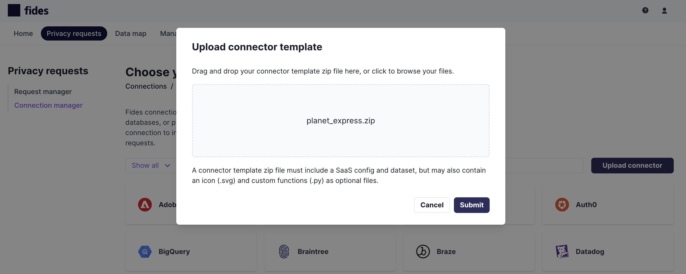

# Custom Connector Templates

Fides has the ability to define custom connector templates during runtime in the form of connector template uploads.
This feature is available to admin users from the **Choose your connection** screen.


## Requirements

A connector template is uploaded to Fides in the form of a zip file. This zip file must be created manually outside of Fides and must include the following:

- [SaaS config](../advanced_configuration/saas_configuration) (required) File must end in _config.yml_
- [Dataset](../../../fides/dsr_quickstart/dsr_support/datasets) (required) File must end in _dataset.yml_

You can optionally also include the following:

- Functions (optional) A Python file (\*.py) containing your [custom strategies](custom_strategies) and/or [request overrides](request_overrides)
- Icon (optional) An svg icon to be used in the UI to represent your custom connector

## Upload connector template

Clicking the **Upload connector** button will present you with a modal to upload your custom connector templates. From here you can click the drop zone to open the file selector or drag and drop your custom connector template zip file.

If the template passes validation, your new connector template will be saved and available for use.


## Behind the scenes

- The SaaS config and dataset are validated to ensure proper formatting and compliance with the Fides system requirements.
- Custom strategies or request overrides are dynamically loaded if available.
- The files in the custom connector template are written to the `custom_connector_template` table in the Fides database to be available between server restarts.

## System settings and security considerations

In order to support the full flexibility of the SaaS connector framework we needed to enable dynamic code execution during runtime be able to register custom strategies and request overrides provided from the connector templates. This has the potential to be insecure so we took the following precautions:

- The upload of connector templates is restricted to users with the `CONNECTOR_TEMPLATE_REGISTER` scope.
- Custom strategies and request overrides are loaded in a [RestrictedPython](https://restrictedpython.readthedocs.io/en/latest/index.html) context to prevent common exploits such as importing low-level modules (`os`, `sys`, `subsystem`, etc.).
- The `security.allow_custom_connector_functions` system setting must be enabled to allow the processing of custom templates with custom functions. For security reasons, this setting is disabled by default. However, custom connector templates that do not require custom code can still be uploaded even if this setting is disabled, as these simple connectors only utilize the functionality that is already available within Fides.

Another option for supporting custom connector functions without allowing dynamic code execution involves the following steps:

1. Check out a local version of Fides
2. Add your custom code to the [override_implementations](https://github.com/ethyca/fides/tree/main/src/fides/api/ops/service/saas_request/override_implementations) directory
3. Build and deploy your custom Fides image

## The replaceable flag

The SaaS config has a field called `replaceable`, it indicates that the custom connector template created from this SaaS config can be replaced by any updates to the official connector templates provided by Fides. If a connector is not marked as replaceable it will be treated as a custom connector template that has deviated from the official Fides version. In either case, the custom connector templates will hide the official versions of the connector template with a matching `type`.

```yaml
saas_config:
  fides_key: <instance_fides_key>
  name: Zendesk
  type: zendesk
  description: A sample schema representing the Zendesk connector for Fides
  version: 0.0.1
  replaceable: True
```
