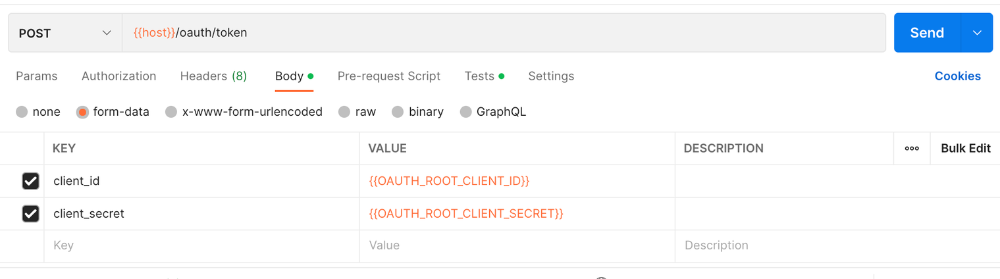
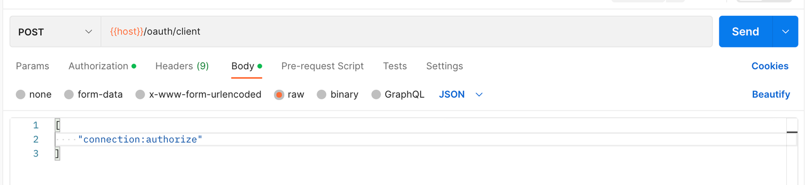
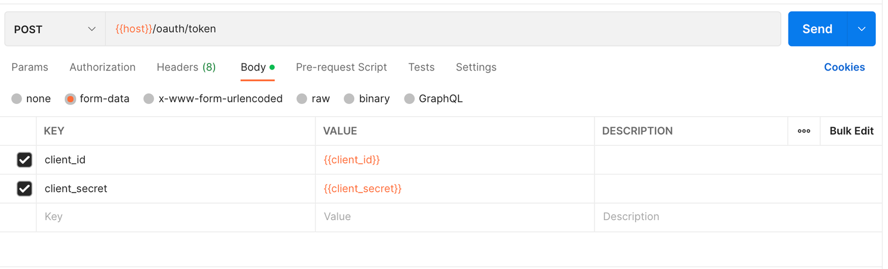
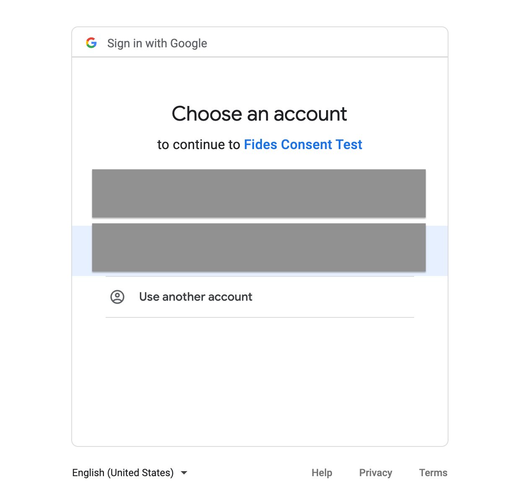
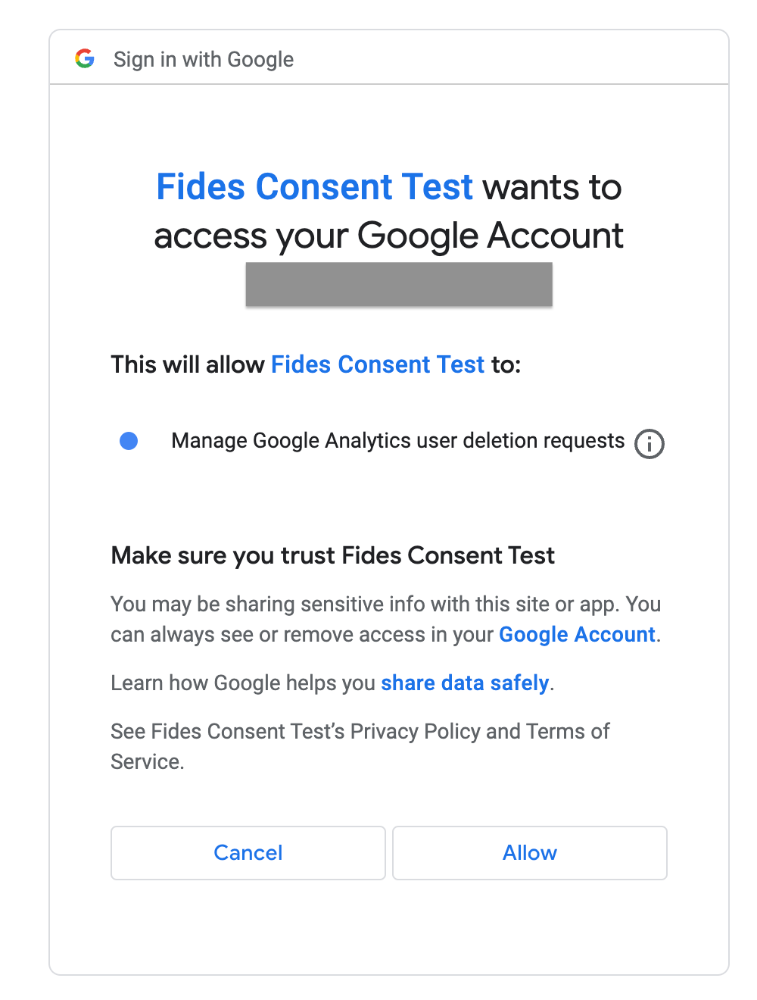

import Callout from 'nextra-theme-docs/callout'

# Universal Analytics Connector (Consent)

## Implementation Summary

Fides automatically pulls in the user's information from the cookie in the user's browser and calls the [user deletion API](https://developers.google.com/analytics/devguides/config/userdeletion/v3) for user opt-out requests. 

|Consent Request | Description |
|----|----|
| Opt-in | No action is taken. For Opt-out we are just deleting the user and not removing them from any reject list, so no action is required to make the user "enabled" for Universal Analytics.|
| Opt-out | Fides will automatically pull the `userId` of the user and use it to trigger a [user delete request](https://developers.google.com/analytics/devguides/config/userdeletion/v3).|

At a high level, these are the steps required to enable the Universal Analytics connector.
1. Retrieve `webPropertyId` from your Universal Analytics setup.
2. Enable Google API access.
3. Configure Universal Analytics connectors in Fides UI.

We will expand these 3 steps in detail in the following sections.

### 1. Retrieving `webPropertyId` 

###### 1.1. Go to your Google Analytics console with the Universal Analytics project.
###### 1.2. Click on the property settings tab
###### 1.3. Note the Tracking Id, generally it's in the format of `UA-xxxxxxxxx-x`, where x is a number.

### 2. Enabling API Access

###### 2.1. [Go to console.cloud.google.com](https://console.cloud.google.com/welcome?project=balmy-flash-377421)

###### 2.2. Select an existing project or create a new one

###### 2.3. Click on "New Project" if you want to create a new one

###### 2.4. Give the project a name

###### 2.5. Click on "Create"

###### 2.6. Go to the project page and click to expand the navigation menu

###### 2.7. Click on "Enabled APIs & services"

###### 2.8. Type "google analytics api"

###### 2.9. Click on Google Analytics API. The Analytics API provides access to Analytics configuration and report data.

###### 2.10. Click on "Enable"

###### 2.11. Click on "Credentials"

###### 2.12. Click on "Configure Consent Screen"

###### 2.13. Select "Internal"

###### 2.14. Click on "Create"

###### 2.15. Give a descriptive name and enter the required details

###### 2.16. Click on Save and Continue

###### 2.17. Click on Add or Remove Scopes

###### 2.18. Now manually add the scope "https://www.googleapis.com/auth/analytics.user.deletion"

###### 2.19. Click on Add to Table

###### 2.20. Click on Update

###### 2.21. Click on Save and Continue

###### 2.22. Click on Back to Dashboard

###### 2.23. Click on Credentials

###### 2.24. Click on Create Credentials

###### 2.25. Click on OAuth client ID…

###### 2.26. Click on Application type

###### 2.27. Click on Web application

###### 2.28. Type a descriptive name

###### 2.29. Click on Add URI

###### 2.30. Type in the url where you have hosted Fides along with the additional path 
`<Hosted Fides Url>/api/v1/oauth/callback`

###### 2.31. Make note of the Redirect URI

###### 2.32. Click on Create

###### 2.33. Copy Client ID

###### 2.34. Copy Client Secret

###### 2.35. Download and securely store the JSON

### 3. Configuring Universal Analytics Connector in Fides UI

###### 3.1. Log into your Fides Admin UI

###### 3.2. Click on the Privacy requests tab

###### 3.3. Click on the Connection manager tab

###### 3.4. Click on Create new connection

###### 3.5. Search for Universal Analytics and select the connector

###### 3.6. Click on Universal Analytics

###### 3.7. Give a descriptive name and a unique identifier

###### 3.8. Enter the Client Id, Secret, Redirect Uri as noted from previous steps

###### 3.9. Enter the Web Property Id as retrieved from the Unviersal Analytics setup

###### 3.10. Click **Save**

###### 3.11. Click **Save** to associate the default dataset

#### OAuth workflow

The goal of the OAuth process is to authenticate the connector and give respective permissions for Google API. Please use Postman or any other client of your choice for running API calls.

##### Create a Fides access_token via the API with `connection:authorize scopes`

###### 3.12. Get a root client token, passing in your root `client id` and `secret` as form data.

The response returns an `access_token`

###### 3.13. Use that access token as Bearer token to create a client with `connection:authorize` scopes

The response returns a fides `client_id` and `client_secret`

###### 3.14. Use that `client_id` and `client_secret` to get a new token for that client

The response returns an `access_token`. 

##### Get an authorization code from Google Analytics

###### 3.15 Do a GET to the Fides connection authorize endpoint 

`GET /api/v1/connection/{connection_key}/authorize`

Use the Fides `access_token` above as a Bearer token and the connector key defined for the connector as the `connection_key`

###### 3.16. A URL is generated in the following format, please navigate to the URL in a browser.

`https://accounts.google.com/o/oauth2/v2/auth?client_id=...&redirect_uri=...&response_type=code&state=...&prompt=consent&scope=..`

###### 3.17 After following that URL, you should be prompted to log into your Google account 

###### 3.18 Give Fides permission to manage google analytics user deletion requests

###### 3.19 Automatic Fides Redirect

Clicking “Allow” prompts the authentication service to send a request back to Fides at the redirect URI with an authentication code.  Fides then takes this and makes a separate request to POST / oauth2.googleapis.com/token to get an access token which it stores on your Fides Google Analytics connector. All of this is done automatically, there is no manual interference required in this step.

**Your Google Analytics connector is now set up to use OAuth 2.0 and is ready to process consent requests!**