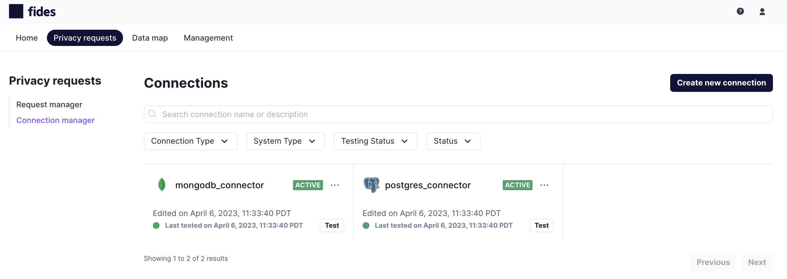
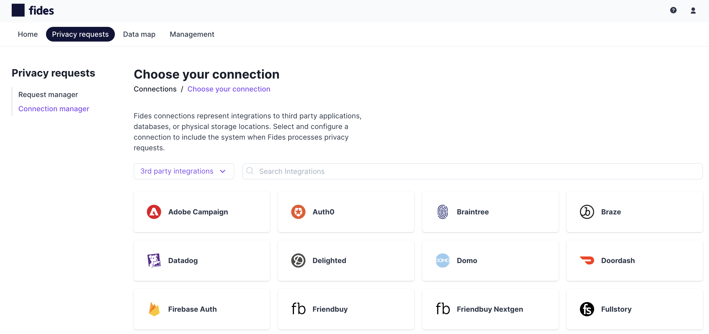
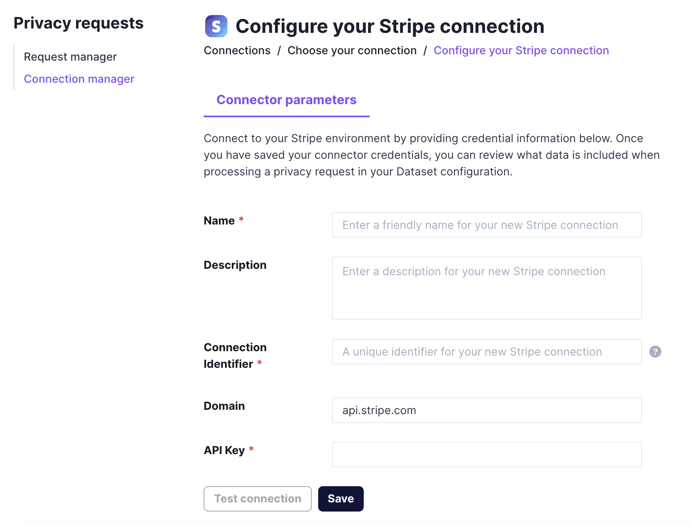

# Configuring Connectors

Fides comes pre-installed with a collection of connector templates specifically designed for SaaS applications. These templates differ from database connectors in that they include pre-configured sets of files with predefined datasets, making it even easier to establish connections. You do not need to dive into the details of specific endpoints or set up datasets themselves. You simply need to provide your credentials for the desired SaaS application, and it will be accessible for handling incoming privacy requests.

## Configuring a SaaS connection from the UI

1. Navigate to **Privacy requests > Connection manager** and click on **Create new connection**.
   
2. Select **3rd party integration** from the dropdown to filter for SaaS connectors.
   
3. Click on a connector to start the configuration.
   
4. Once you've entered the settings, click **Save** to finish.

## Additional details

SaaS connections created from connector templates also have the advantage of seamless updates. As new versions of the templates are released with Fides, these connections will automatically stay current. For instance, if endpoints are added or removed for a SaaS connector template, any connection created from the template will auto-update once the updated Fides server is restarted. This ensures that your SaaS connections remain functional and up-to-date with the latest changes in the connector templates.
