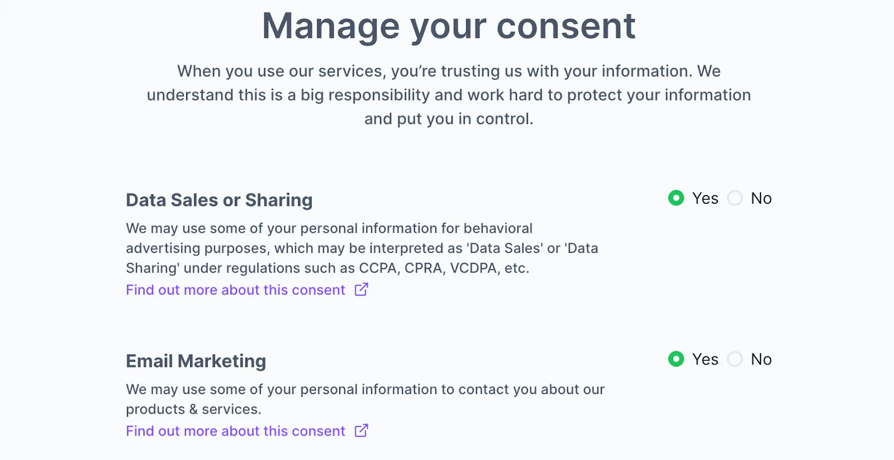

import Callout from 'nextra-theme-docs/callout'

# CPRA Step 03
# Update your opt-out notices to reflect new user rights

Depending on how you process data, there are several options you may need to present to your visitors to correctly afford them their rights:

## **Option 1**: “Do Not Sell Or Share My Personal Information”

    In the event your data mapping exercise identifies that you are sharing personal data for the purpose of behavioral marketing, you must provide a mechanism for the user to opt-out of this process. 

    In order to do this, first place a link in the footer of your website, typically where your Privacy Policy and Terms & Conditions are located, similar to the screenshot below.
    
    

    This should link to a solution that allows a consumer to record their consent preferences in order to opt-out. Ensure that this is enforced across all systems that are involved in data sales and sharing for behavioral marketing purposes. 

    An important note here: often this is confused with “cookie consent banner” where the assumption is this is about preventing data flow from your website. While some data flows from your website (the front end), data may also be flowing via internal systems and back end processes to third parties. It is equally important that your data sales solution is able to enforce this preference of consent across all areas of your tech stack. 

    To learn more about how Ethyca’s true data consent automation can de-risk compliance for all data processes in any data flow  for your business, speak to our [Privacy Solutions Team now.](https://ethyca.com/book-demo)

## **Option 2**: “Limit The Use Of My Sensitive Personal Information”

    If you are also processing Sensitive Personal Information, you must provide the consumer with the ability to opt-out of this process. 

    Similar to Data Sales and Sharing, you should provide a link in the footer of your site to allow a user to “Limit The Use of My Sensitive Personal Information”, similar to the example below:

    

    This should link to a solution that allows a consumer to record their consent preferences in order to opt-out and ensure that this is enforced across all systems that are involved in data sales and sharing for behavioral marketing purposes. 

    To learn more about how Ethyca’s true data consent automation can derisk compliance for all data processes in any data flow  for your business, speak to our [Privacy Solutions Team](https://ethyca.com/book-demo) now.

## **Option 3**: Where applicable, provide an option for a user to “Opt out of automated decision making”

    Similar to the other opt-out mechanisms listed above, where you are processing data through automated decision making technologies, you should provide the user a link so that the user can change their preferences and opt-out of automated decision making processes.

## **Option 4**: Alternative Solution for multiple data processes: if you are doing more than one of the above!

    If your data mapping and inventory process identified that you are sharing data and also processing SPI (sensitive personal information), you can consolidate the labels together to provide one link in your footer that offers the user the option to “Manage My Personal Information and Sharing Preferences,” similar to the example below:

    

    In this example, a single link brings the user to a panel to manage their personal data preferences. If you’re using Fides, this might look something like the example below:

    

    As can be seen from the examples above, depending on the way your business and systems process data, you may want to present these preferences to your user in multiple ways.

    <Callout emoji="ⓘ">
    If you're unsure how to configure your website, app or footer for CPRA's data sales and sharing regulations, ask a question on the [Fides Slack Community](https://fid.es/join-slack), or get [Privacy Engineering Intelligence from Ethyca](https://ethyca.com/book-demo) now.
    </Callout>