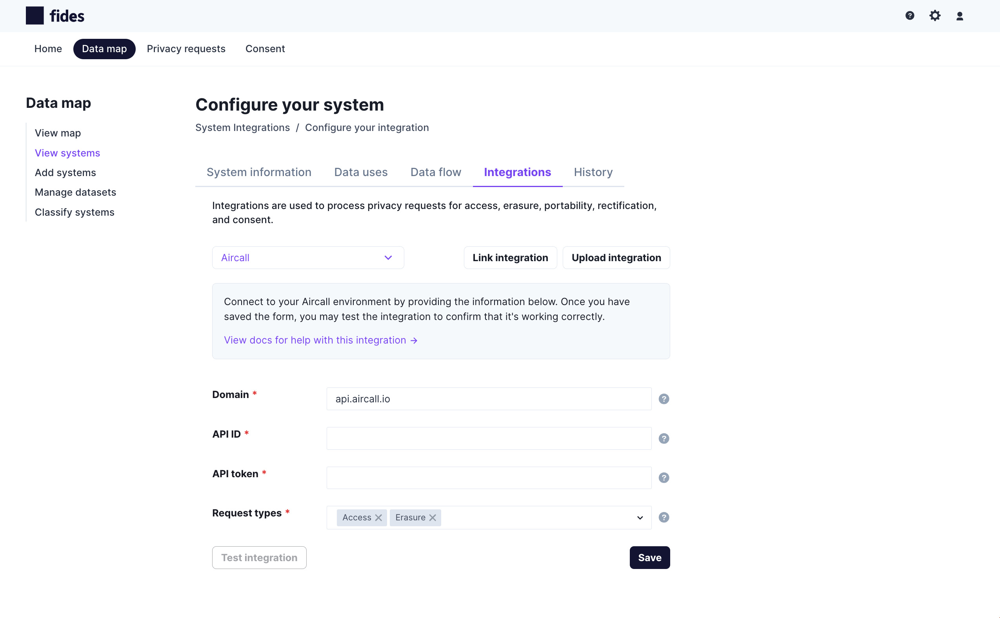

import { Callout } from 'nextra-theme-docs'
import TutorialKey from 'components/tutorialkey'
import Screenshot from 'components/screenshot'

<Callout emoji="ⓘ">Fides recently deprecated the _Connection Manager_ UI. For steps to migrate your connectors to system integrations, please see the [Migrate from the Connection manager section](#migrate-from-the-connection-manager).</Callout>

# Integrations: managing integations

## Introduction

In this guide, you'll learn how to:
1. [Integrate with existing systems](#integrate-with-existing-systems)
2. [Enable or disable an integration](#enable-or-disable-an-integration)
3. [Delete an integration](#delete-an-integration)
4. [Upload a custom connector template](#upload-a-connector-template)

To learn more about _Integrations_ are and to see which vendors we currently support, please see the [Overview](index).

## Integrate with existing systems
<Callout emoji="ⓘ">This guide assumes you've already added the systems to your data map that you are integrating with. If this is not the case, please follow the steps in the Data Mapping guide to add these sytems to the Data Map.</Callout>

To integrate with a system that's already in your data map:

### 1. Collect the information that you will need to connect to the system
For each vendor, you'll need to provide unique connection credentials. Our vendor guides, outline the information you need to collect, making it easier to gather the required credentials and set up the connections:
* [SaaS vendor guides](saas-integrations/saas-configs)
* [Database vendor guides](databases/db-configs)

### 3. Configure the connection information and test the integration

1. Navigate to **Data map** → **View Systems** and choose the system that you want to integrate with.
2. Click on the **Integrations** tab.
3. Select the appropriate vendor from the **Connection type** drop-down menu.
4. Enter the information collected in Step 3 and click **Save**. 
5. Test the integration using the **Test connection** button, if desired.

<Callout emoji="ⓘ">Some systems require that you authenticate using OAuth2. Our guide for doing this is _coming soon_ but please reach out in the meantime for assistance.</Callout>

### 4. Configure the dataset
If you are connecting to a database, you will need to create a dataset in order to process Data Subject Requests (DSRs).  For detailed steps, please see our guide for [Managing datasets using the UI](manage-datasets).

## Enable or disable an integration
_Coming soon!_ 

## Delete an integration
To delete an integration:

1. Navigate to the system: **Data map** → **View Systems** and choose the system that you want to delete the integration from. 
2. Click on the **Integrations** tab.
3. Scroll to the bottom of the form and click **Delete**.

## Upload a custom template

To add a new custom integration:
1. Navigate to the system: **Data map** → **View Systems** and choose the system that you want to integrate with. 
2. Click on the **Integrations** tab.
3. Click on the **Upload connector** button.
4. Upload the custom template, in the form of a _Zip_ file, using the resulting modal.

Steps for creating a custom config are _coming soon_!

## Migrate from the Connection manager

Fides recently moved from supporting standalone connectors to System-based Integrations. To ease the migration to the new system, the **Connection manager** UI will remain accessible as long as there are unlinked connectors available. 

To link a connector to a system:

1. Navigate to **Data map** → **View Systems** and choose the system that you want to link a connector to. 
2. Click on the **Integrations** tab.
3. Click **Link connector**.
4. Select the connection from the list of unlinked connections.
5. Click **Link connector**
6. Click **Save**

This connector will no longer appear in the **Connection manager** UI. 

