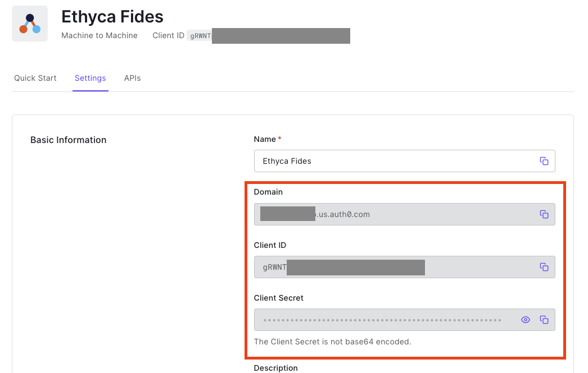
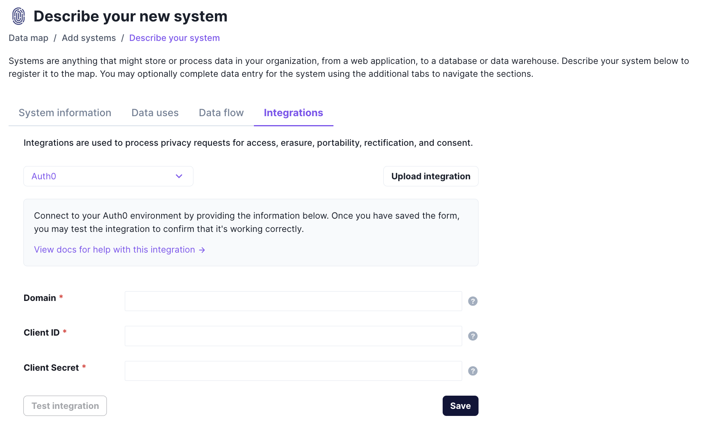

# Auth0
[Auth0](https://auth0.com/) is an identity platform that provides authentication, authorization, and single sign-on services for applications, helping developers integrate secure user authentication and management into their software.

## Prerequisites

In order to [integrate](../) with Auth0, you'll need to collect the following information:

| Name                       | Description                                                                                                                             |
| :------------------------- | :-------------------------------------------------------------------------------------------------------------------------------------- |
| **Domain***                | The unique URL for your Auth0 instance |
| **Client ID***                 | Your Auth0 application's client ID. Follow Auth0's docs for [steps to retrieve this key](https://auth0.com/docs/get-started/authentication-and-authorization-flow/call-your-api-using-the-client-credentials-flow) |
| **Client secret***                | Your Auth0 application's client secret. Follow Auth0's docs for [steps to retrieve this key](https://auth0.com/docs/get-started/authentication-and-authorization-flow/call-your-api-using-the-client-credentials-flow)  |


## Integrating with Auth0
To integrate an existing system with Auth0:

1. Navigate to **Data map** → **View Systems** and choose the system that you want to connect.
2. Click on the **Integrations** tab.
3. Pick the vendor or system type that you want to integrate with from the **Connection type** drop-down menu.
4. Complete the required fields for the integration and click **Save**. 

You may confirm your connection is working using the **Test connection** button, if desired.

To learn more, please see our guide for [Managing Integrations](/user-guides/integrations/manage-integrations).

## Technical detail 

Fides utilizes _API endpoints_ to access the _API service_ for a SaaS application. An _API service_ is the programmatic interface through which Fides can query and update data within an application to access, rectify, or delete personal information. Each SaaS tool will have a unique set of endpoints to enable privacy functions. 

### Auth0 endpoints
In the table below, you can find which endpoints are used for each type of privacy function. Clicking on the endpoint will take you to the documentation for that endpoint.

| Privacy function | Endpoint | Description |
|----|----|----|
| **Access Requests**            | [Users](https://auth0.com/docs/api/management/v2/users-by-email/get-users-by-email) | Returns users by email |
| **Access Requests**            | [User Logs](https://auth0.com/docs/api/management/v2/logs/get-logs-by-id) | Retrieves user logs by user_id |


### Implementation Summary

#### Scopes

The following Auth0 scopes are required for executing the privacy requests using the Auth0 Management API:

* read:users
* delete:users
* read:logs
* read:logs_users

#### Connection Settings

This connection may be customized using the instructions found in the [configuration guide](../saas_config).

**Deletion requests** are fulfilled by masking PII via `DELETE` endpoints. To [give Fides permission](../../../get_started/configuration#configuration-variable-reference) to remove PII using `DELETE` endpoints, ensure the `masking_strict` variable in your `fides.toml` or environment file is set to `false`.

#### Implementation

##### 1. Setting up Machine to Machine Application in Auth0  

Using the Auth0 Management Console, Navigate to Applications -> Applications. Click on the Create Application Button. Create the Ethyca Fides Application and click Machine to Machine Applications and press create.

 
Select the Auth0 Management API and add the `read:users`, `delete:users`, `read:logs`, and `read:logs_users` scopes and click Authorize

 
Navigate to the settings tab of the Ethyca Fides Application. Notate the Domain, Client ID, and Client Secret Values


##### 2. Configuring Auth0 SaaS Connector in Fides

Navigate to the connection Manager and Click on the Auth0 Tile. Fill in the Domain, Client ID, and Client Secret and click save


## Example Auth0 Configuration

```yaml
saas_config:
  fides_key: <instance_fides_key>
  name: Auth0 SaaS Config
  type: auth0
  description: A sample schema representing the Auth0 connector for Fides
  version: 0.0.2

  connector_params:
    - name: domain
    - name: client_id
      label: Client ID
    - name: client_secret

  client_config:
    protocol: https
    host: <domain>
    authentication:
      strategy: oauth2_client_credentials
      configuration:
        token_request:
          method: POST
          path: /oauth/token
          body: |
            {
              "grant_type": "client_credentials",
              "audience": "https://<domain>/api/v2/",
              "client_id": "<client_id>",
              "client_secret": "<client_secret>"
            }
        refresh_request:
          method: POST
          path: /oauth/token
          body: |
            {
              "grant_type": "client_credentials",
              "audience": "https://<domain>/api/v2/",
              "client_id": "<client_id>",
              "client_secret": "<client_secret>"
            }

  test_request:
    method: GET
    path: /api/v2/users-by-email
    query_params:
      - name: email
        value: test@test.com

  endpoints:
    - name: users
      requests:
        read:
          method: GET
          path: /api/v2/users-by-email
          query_params:
            - name: email
              value: <email>
          param_values:
            - name: email
              identity: email
        delete:
          method: DELETE
          path: /api/v2/users/<user_id>
          param_values:
            - name: user_id
              references:
                - dataset: <instance_fides_key>
                  field: users.user_id
                  direction: from
    - name: user_logs
      requests:
        read:
          method: GET
          path: /api/v2/users/<user_id>/logs
          param_values:
            - name: user_id
              references:
                - dataset: <instance_fides_key>
                  field: users.user_id
                  direction: from
```

